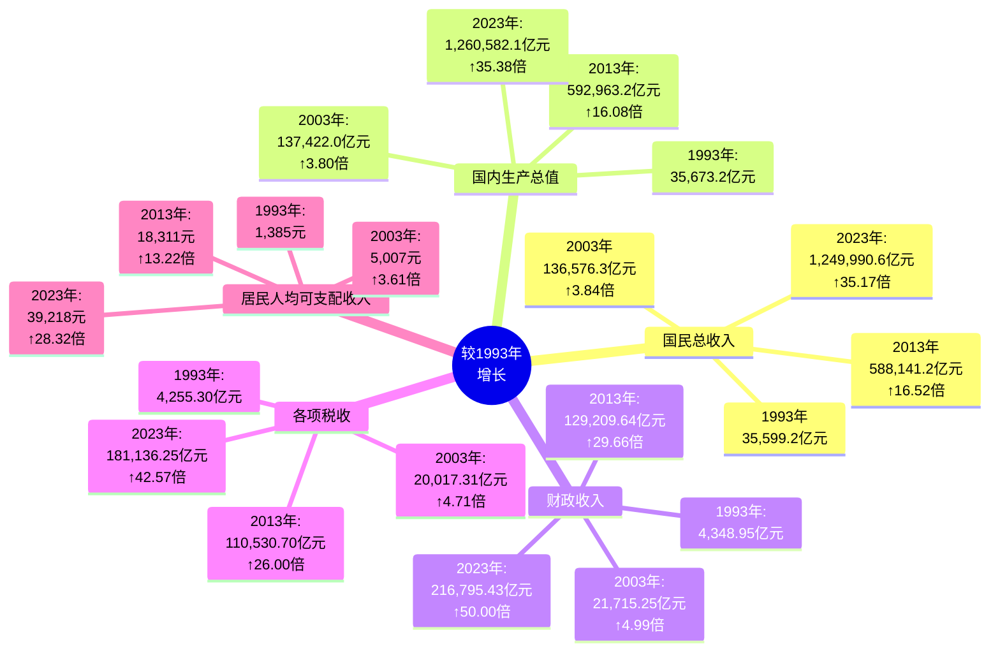

```mermaid
mindmap
  root((较1993年<br>增长))
    国民总收入
      1993年<br>35,599.2亿元
      2003年<br>136,576.3亿元<br>↑3.84倍
      2013年<br>588,141.2亿元 <br>↑16.52倍
      2023年:<br> 1,249,990.6亿元 <br>↑35.17倍
    国内生产总值
      1993年: <br>35,673.2亿元
      2003年: <br>137,422.0亿元 <br>↑3.80倍
      2013年:<br> 592,963.2亿元 <br>↑16.08倍
      2023年: <br>1,260,582.1亿元 <br>↑35.38倍
    财政收入
      1993年: <br>4,348.95亿元
      2003年: <br>21,715.25亿元 <br>↑4.99倍
      2013年:<br> 129,209.64亿元 <br>↑29.66倍
      2023年:<br> 216,795.43亿元 <br>↑50.00倍
    各项税收
      1993年:<br> 4,255.30亿元
      2003年: <br>20,017.31亿元 <br>↑4.71倍
      2013年: <br>110,530.70亿元 <br>↑26.00倍
      2023年: <br>181,136.25亿元 <br>↑42.57倍
    居民人均可支配收入
      1993年:<br> 1,385元
      2003年:<br> 5,007元 <br>↑3.61倍
      2013年: <br>18,311元 <br>↑13.22倍
      2023年: <br>39,218元 <br>↑28.32倍
```

