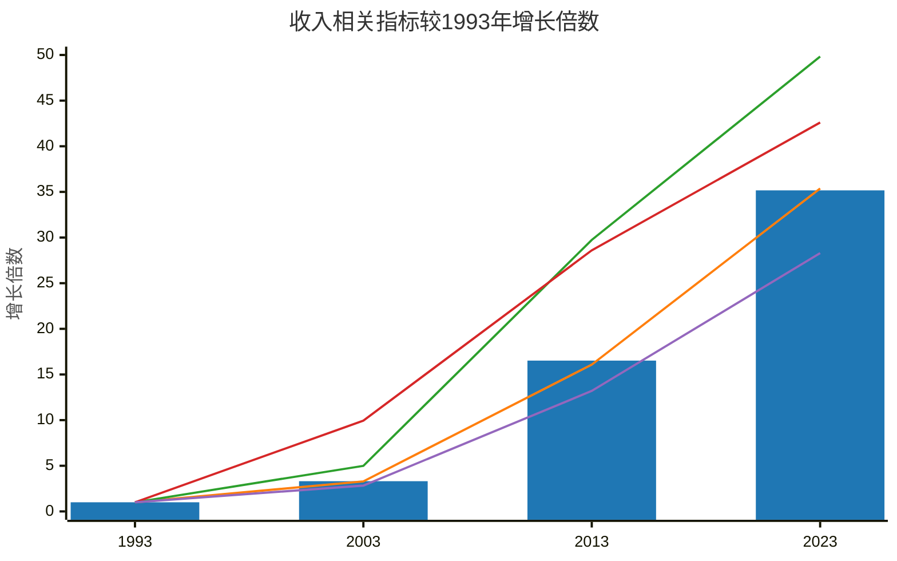

```mermaid
---
config:
    xyChart:
        width: 800
        height: 500
    themeVariables:
        xyChart:
            titleColor: "#333333"
            xAxisTitleColor: "#555555"
            yAxisTitleColor: "#555555"
            plotColorPalette: "#1f77b4, #ff7f0e, #2ca02c, #d62728, #9467bd"
---
xychart-beta
    title "收入相关指标较1993年增长倍数"
    x-axis [1993, 2003, 2013, 2023]
    y-axis "增长倍数" 0 --> 50
    bar [1, 3.31, 16.52, 35.17]
    line [1, 3.29, 16.08, 35.38]
    line [1, 4.99, 29.74, 49.83]
    line [1, 9.94, 28.6, 42.6]
    line [1, 2.83, 13.2, 28.3]
```
 

图例： 
■ 国民总收入（柱状图） 
■ 国内生产总值（折线图） 
■ 财政收入（折线图） 
■ 各项税收（折线图） 
■ 居民人均可支配收入（折线图） 

数据来源：国家统计局