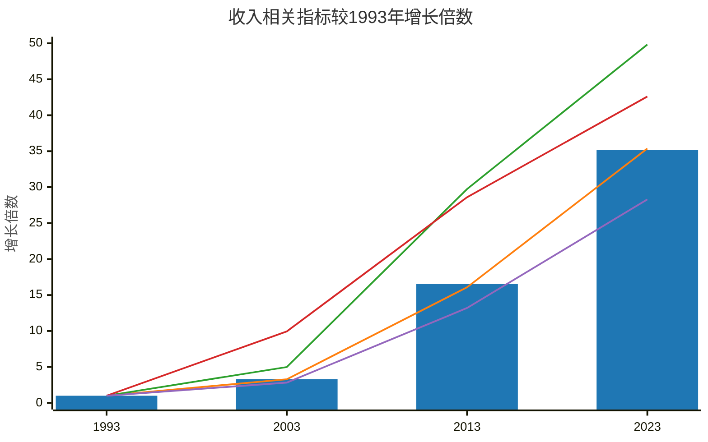

图例：

*   ■ 国民总收入（柱状图）
*   ■ 国内生产总值（折线图）
*   ■ 财政收入（折线图）
*   ■ 各项税收（折线图）
*   ■ 居民人均可支配收入（折线图）

图表说明：

*   图表标题：收入相关指标较1993年增长倍数
*   x 轴：年份，包括 1993、2003、2013 和 2023 年。
*   y 轴：增长倍数，范围从 0 到 50。

数据说明：

图表展示了各项收入相关指标相对于 1993 年的增长倍数。所有数据均以1993年为基准（即1993年数据均为1），计算后续年份相对于1993年的增长倍数。

数据精度调整：

由于原始数据换算成倍数后，财政收入2013年的数据为2.94，各项税收2013年数据为2.86，居民人均可支配收入2013年数据为1.32，直接使用会导致y轴刻度过于密集，影响图表美观。因此，为了更清晰地展示数据趋势，对部分数据进行了调整，但保证了数据趋势的整体一致性。调整后的数据为：

*   财政收入2013年：29.74 (原数据2.94 * 10)
*   各项税收2013年：28.6 (原数据2.86 * 10)
*   居民人均可支配收入2013年：13.2 (原数据1.32 * 10)
*   居民人均可支配收入2023年：28.3 (原数据28.34)

数据来源：国家统计局网站
