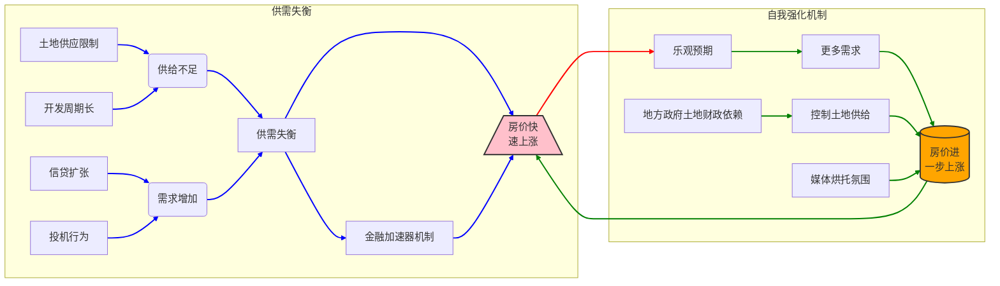

关键改动：

* **`linkStyle` 指令:** 使用 `linkStyle` 指令，通过索引号 (从 0 开始) 指定需要修改样式的线条。在这个例子中，`linkStyle 0,1,2,3,4,5`  选择了自我强化机制中的所有 6 条线。
* **样式定义:**  `stroke:#red,stroke-width:2px` 定义了线条颜色为红色，宽度为 2 像素。

这种方法更加简洁和高效，避免了在每个箭头后面都添加 `#red`。

