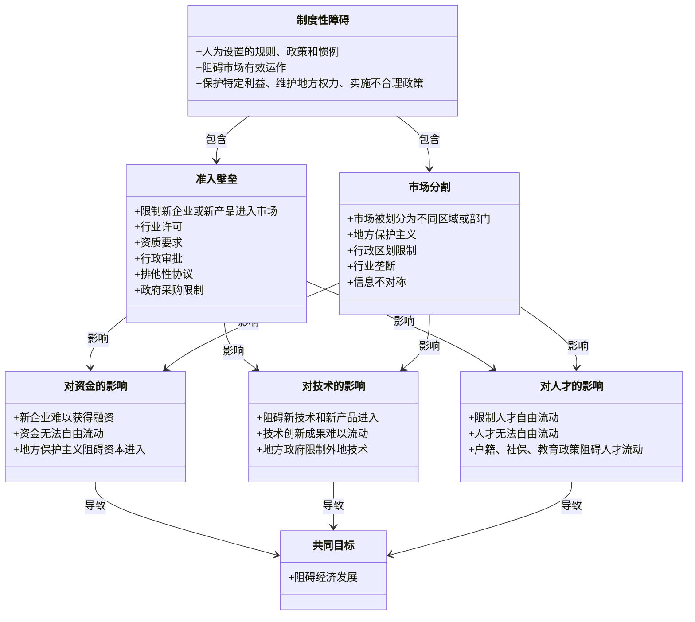

    %% 定义节点样式
    classDef institutionalBarrier fill:#f8b195,color:#000,stroke:#333,stroke-width:2px
    classDef entryBarrier fill:#a8dadc,color:#000,stroke:#333,stroke-width:2px
    classDef marketSegmentation fill:#ffc,color:#000,stroke:#333,stroke-width:2px
    classDef capitalImpact fill:#e6e6e6,color:#000,stroke:#333,stroke-width:2px
    classDef technologyImpact fill:#cfc,color:#000,stroke:#333,stroke-width:2px
    classDef talentImpact fill:#d9b3ff,color:#000,stroke:#333,stroke-width:2px
    classDef commonGoal fill:#ff6666,color:#fff,stroke:#333,stroke-width:2px
