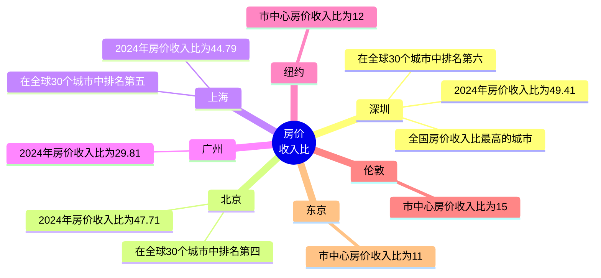

---
<span style="color:#1f77b4; font-weight:; font-size:8px;">☞版权所有©2024 长征♛</span>
---

```mermaid
---
config:
    xyChart:
        width: 1200
        height: 350
    themeVariables:
        xyChart:
            plotColorPalette: "#1f77b4, #ff7f0e, #2ca02c, #d62728, #9467bd"
---

xychart-beta
    title "中国主要城市与国际城市房价收入比" 
    x-axis ["深圳","北京","上海","广州","纽约","伦敦","东京"]
    y-axis "房价收入比" 10 --> 50
    bar [49.41,47.71,44.79,29.81,12,15,11]
 ```
 
    