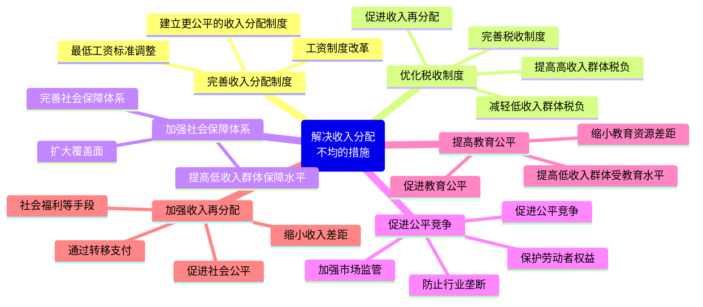

```mermaid
mindmap
  root(解决收入分配<br>不均的措施)
    完善收入分配制度
      建立更公平的收入分配制度
      工资制度改革
      最低工资标准调整
    优化税收制度
      完善税收制度
      提高高收入群体税负
      减轻低收入群体税负
      促进收入再分配
    加强社会保障体系
      完善社会保障体系
      扩大覆盖面
      提高低收入群体保障水平
    促进公平竞争
      加强市场监管
      促进公平竞争
      防止行业垄断
      保护劳动者权益
    提高教育公平
      促进教育公平
      缩小教育资源差距
      提高低收入群体受教育水平
    加强收入再分配
      通过转移支付
      社会福利等手段
      缩小收入差距
      促进社会公平
```