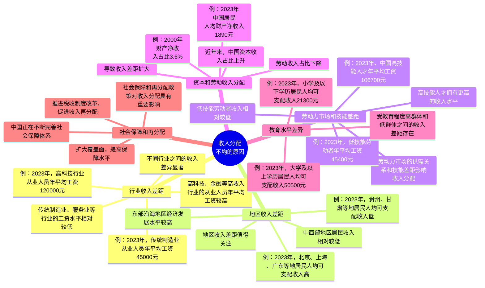

```mermaid
mindmap
  root((收入分配<br>不均的原因))
    行业收入差距
      不同行业之间的收入<br>差异显著
      高科技、金融等高收入<br>行业的从业人员年平均<br>工资较高
      传统制造业、服务业等<br>行业的工资水平相对<br>较低
      例：2023年，高科技行业<br>从业人员年平均工资<br>120000元
      例：2023年，传统制造业<br>从业人员年平均工资<br>45000元
    地区收入差距
      地区收入差距值得<br>关注
      东部沿海地区经济发<br>展水平较高
      中西部地区居民收入<br>相对较低
      例：2023年，北京、上海<br>、广东等地居民人均可<br>支配收入高
      例：2023年，贵州、甘<br>肃等地居民人均可支<br>配收入低
    劳动力市场和技能差距
      劳动力市场的供需关<br>系和技能差距影响<br>收入分配
      高技能人才拥有更高<br>的收入水平
      低技能劳动者收入相<br>对较低
      例：2023年，中国高技<br>能人才年平均工资<br>106700元
      例：2023年，低技能劳<br>动者年平均工资<br>45400元
    资本和劳动收入分配
      近年来，中国资本收<br>入占比上升
      劳动收入占比下降<br>
      导致收入差距扩大<br>
      例：2023年<br>中国居民<br>人均财产净收入<br>1890元
      例：2000年<br>财产净收<br>入占比3.6%
    教育水平差异
      受教育程度高群体和<br>低群体之间的收入<br>差距存在
      例：2023年，大学及以<br>上学历居民人均可<br>支配收入50500元
      例：2023年，小学及以<br>下学历居民人均可<br>支配收入21300元
    社会保障和再分配
      社会保障和再分配政<br>策对收入分配具有<br>重要影响
      中国正在不断完善社<br>会保障体系
      扩大覆盖面，提高保<br>障水平
      推进税收制度改革，<br>促进收入再分配
```