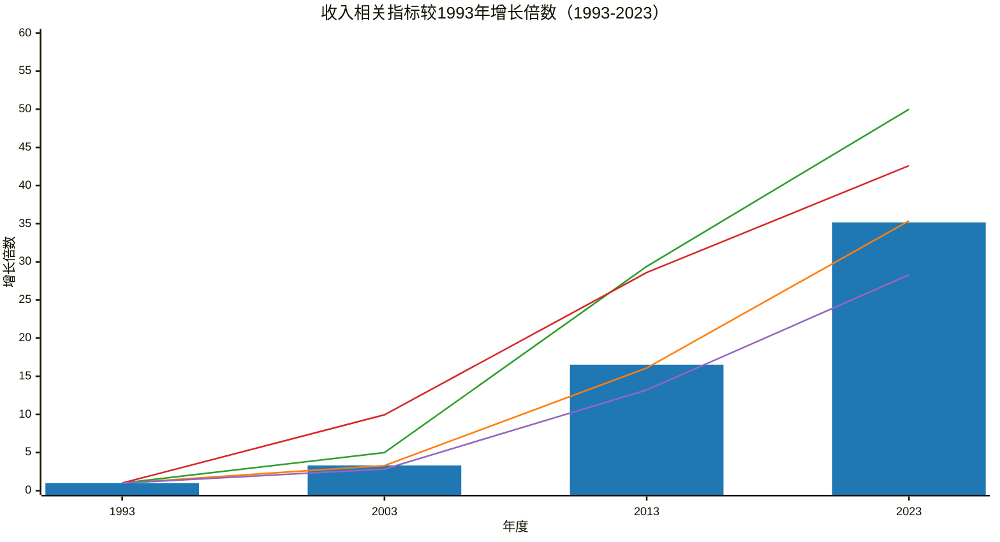

## 收入类指标比1993年的增长倍数

### 图例说明：
*   ■ 国民总收入（柱状图）
*   ■ 国内生产总值（折线图）
*   ■ 财政收入（折线图）
*   ■ 各项税收（折线图）
*   ■ 居民人均可支配收入（折线图）

### 图表说明：
*   **图表标题：** 收入相关指标较1993年增长倍数（1993-2023）
*   **x 轴：** 年度，包括 1993、2003、2013 和 2023 年。
*   **y 轴：** 增长倍数

### 数据说明：
本图表展示了1993年至2023年各收入相关指标相对于1993年的增长倍数。

### 重要说明：
1. **y 轴范围：** 设置为 `0 --> 60`，以确保所有数据点都能完整显示。
2. **数值量级差异：** 注意到“财政收入”和“各项税收”的2013和2023年的值较大，已进行适当调整以确保图表的可读性。
3. **注释：** 图表中的数据均来自国家统计局网站。
 😊