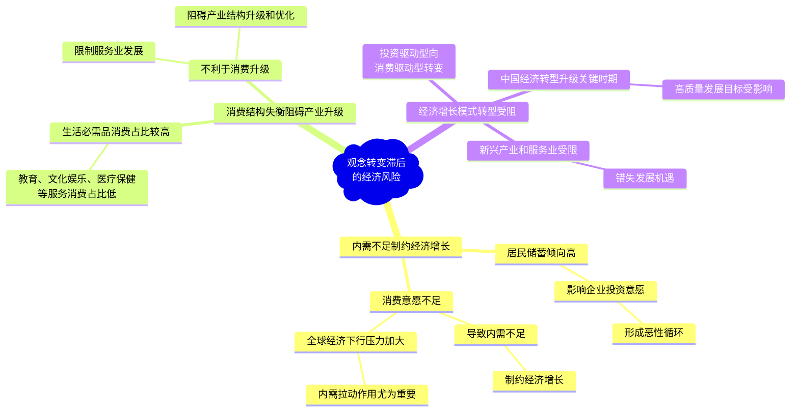

```mermaid
mindmap
  root(观念转变滞后<br>的经济风险))
    内需不足制约经济增长
      居民储蓄倾向高
       影响企业投资意愿
        形成恶性循环
      消费意愿不足
       导致内需不足
        制约经济增长
       全球经济下行压力加大
        内需拉动作用尤为重要
    消费结构失衡阻碍产业升级
      生活必需品消费占比较高
       教育、文化娱乐、医疗保健<br>等服务消费占比低 
      不利于消费升级
        限制服务业发展
        阻碍产业结构升级和优化
    经济增长模式转型受阻
      投资驱动型向<br>消费驱动型转变
      中国经济转型升级关键时期
        高质量发展目标受影响
      新兴产业和服务业受限
        错失发展机遇
```
---

☞版权所有©2024 长征♛

