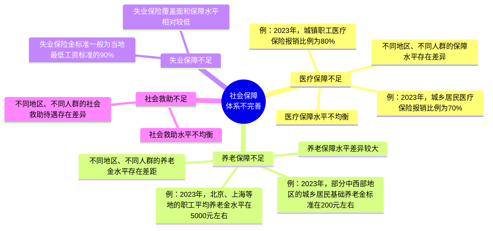

```mermaid
mindmap
  root((社会保障<br>体系不完善))
    医疗保障不足
      医疗保障水平不均衡
      不同地区、不同人群的保障水平存在差异
      例：2023年，城镇职工医疗保险报销比例为80%
      例：2023年，城乡居民医疗保险报销比例为70%
    养老保障不足
      养老保障水平差异较大
      不同地区、不同人群的养老金水平存在差距
      例：2023年，北京、上海等地的职工平均养老金水平在5000元左右
      例：2023年，部分中西部地区的城乡居民基础养老金标准在200元左右
    失业保障不足
      失业保险覆盖面和保障水平相对较低
      失业保险金标准一般为当地最低工资标准的90%
    社会救助不足
      社会救助水平不均衡
      不同地区、不同人群的社会救助待遇存在差异
```
☞版权所有©长征制图♛