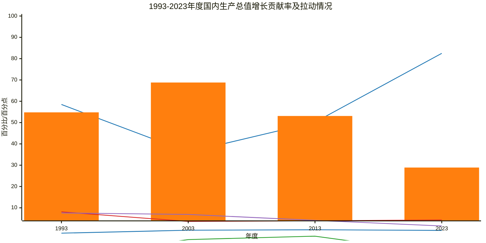

## 1993-2023年度国内生产总值增长贡献率及拉动情况

### 图例说明：
*   ■ 最终消费支出贡献率 (%)
*   — 资本形成总额贡献率 (%)
*   ■ 货物和服务净出口贡献率 (%)
*   — 最终消费支出拉动 (百分点)
*   — 资本形成总额拉动 (百分点)
*   — 货物和服务净出口拉动 (百分点)

### 图表说明：
*   **图表标题：** 1993-2023年度国内生产总值增长贡献率及拉动情况
*   **x 轴：** 年度，包括 1993、2003、2013 和 2023 年。
*   **y 轴：** 百分比/百分点，范围设置为 `-15 --> 100`，以确保所有数据点都能完整显示。
*   **特别说明：** 柱状图用于表示贡献率,为了便于显示，资本形成总额用折线图;其他折线图用于表示拉动情况。 

### 数据说明：
本图表展示了1993年至2023年各因素对国内生产总值增长的贡献率和拉动情况，具体包括：
- 最终消费支出对国内生产总值增长贡献率和拉动情况
- 资本形成总额对国内生产总值增长贡献率和拉动情况
- 货物和服务净出口对国内生产总值增长贡献率和拉动情况

### 重要说明：
1. **y 轴范围：** 设置为 `-15 --> 100`，以确保所有数据点都能完整显示。
2. **数值量级差异：** 注意到不同指标的单位均为百分比或百分点，因此在解读图表时请注意单位一致性。
3. **注释：** 图表中的数据均来自国家统计局统网站。

😊 😊