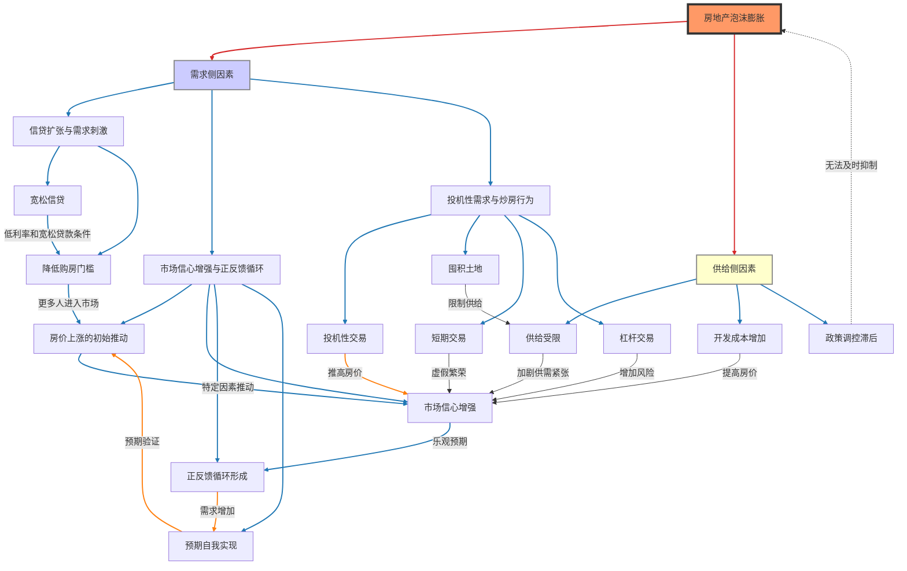

```mermaid
graph TD;
    A[房地产泡沫膨胀] --> B[需求侧因素]
    A --> C[供给侧因素]

    B --> B1[信贷扩张与需求刺激]
    B --> B2[市场信心增强与正反馈循环]
    B --> B3[投机性需求与炒房行为]

    B1 --> B11[宽松信贷]
    B1 --> B12[降低购房门槛]

    B2 --> B21[房价上涨的初始推动]
    B2 --> B22[市场信心增强]
    B2 --> B23[正反馈循环形成]
    B2 --> B24[预期自我实现]

    B3 --> B31[投机性交易]
    B3 --> B32[囤积土地]
    B3 --> B33[短期交易]
    B3 --> B34[杠杆交易]

    C --> C1[供给受限]
    C --> C2[开发成本增加]
    C --> C3[政策调控滞后]

    B11 -->|低利率和宽松贷款条件| B12
    B12 -->|更多人进入市场| B21
    B21 -->|特定因素推动| B22
    B22 -->|乐观预期| B23
    B23 -->|需求增加| B24
    B24 -->|预期验证| B21

    B31 -->|推高房价| B22
    B32 -->|限制供给| C1
    B33 -->|虚假繁荣| B22
    B34 -->|增加风险| B22

    C1 -->|加剧供需紧张| B22
    C2 -->|提高房价| B22

    C3 -.->|无法及时抑制| A
    %% 使用 -.-> 表示虚线

    style A fill:#f96,stroke:#333,stroke-width:4px
    style B fill:#ccf,stroke:#888,stroke-width:2px
    style C fill:#ffc,stroke:#888,stroke-width:2px

    linkStyle 0,1 stroke:#d62728,stroke-width:2px
    linkStyle 2,3,4,5,6,7,8,9,10,11,12,13,14,15,16,17,18,19,20,21 stroke:#1f77b4,stroke-width:2px
    linkStyle 22,23,24 stroke:#ff7f0e,stroke-width:2px

```

