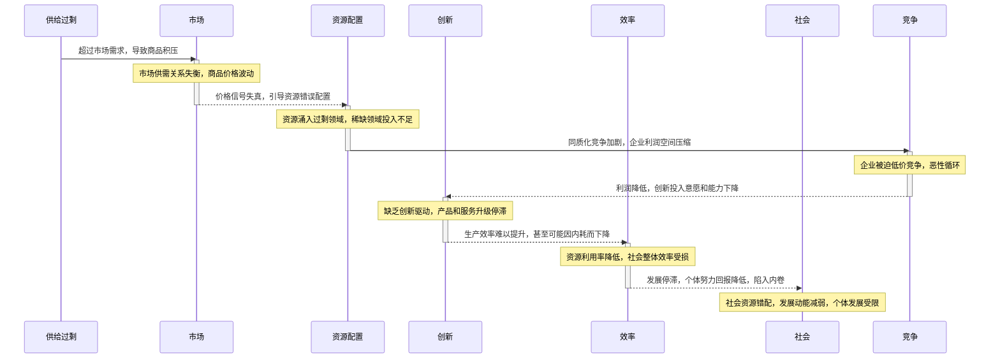
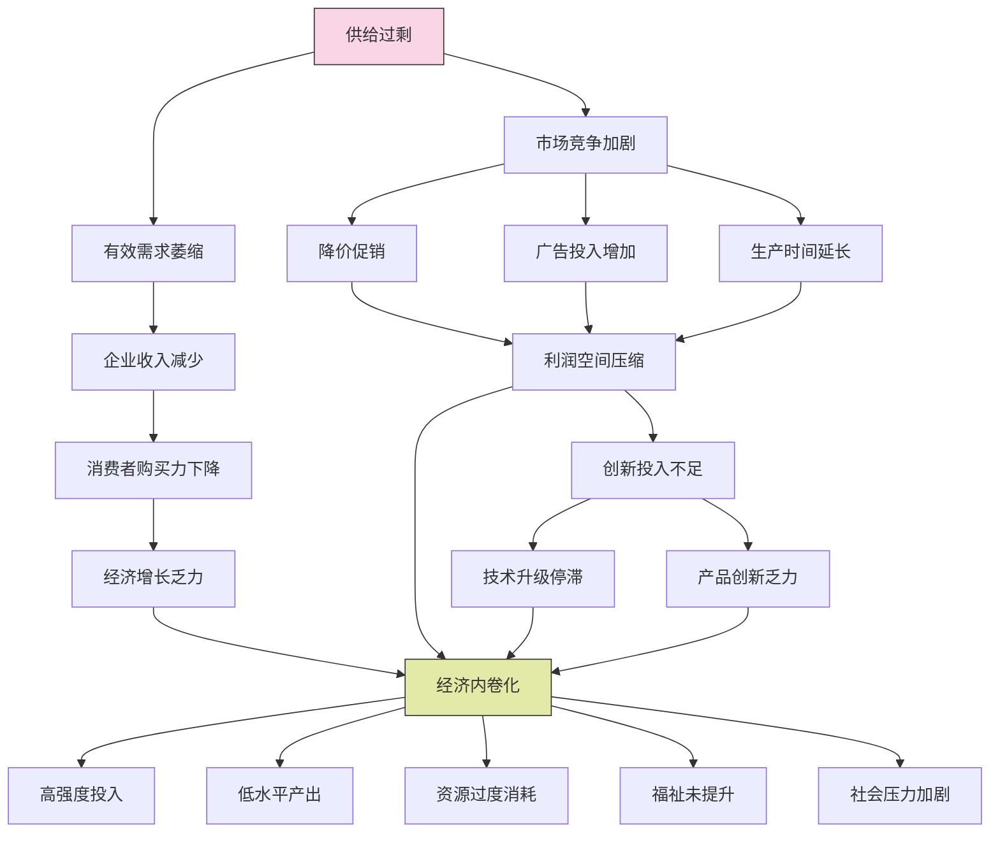
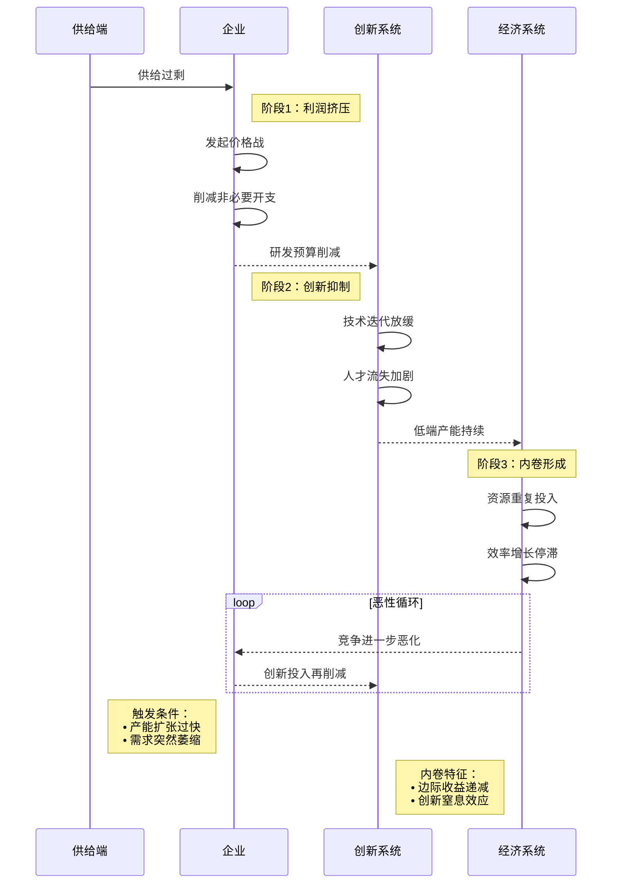
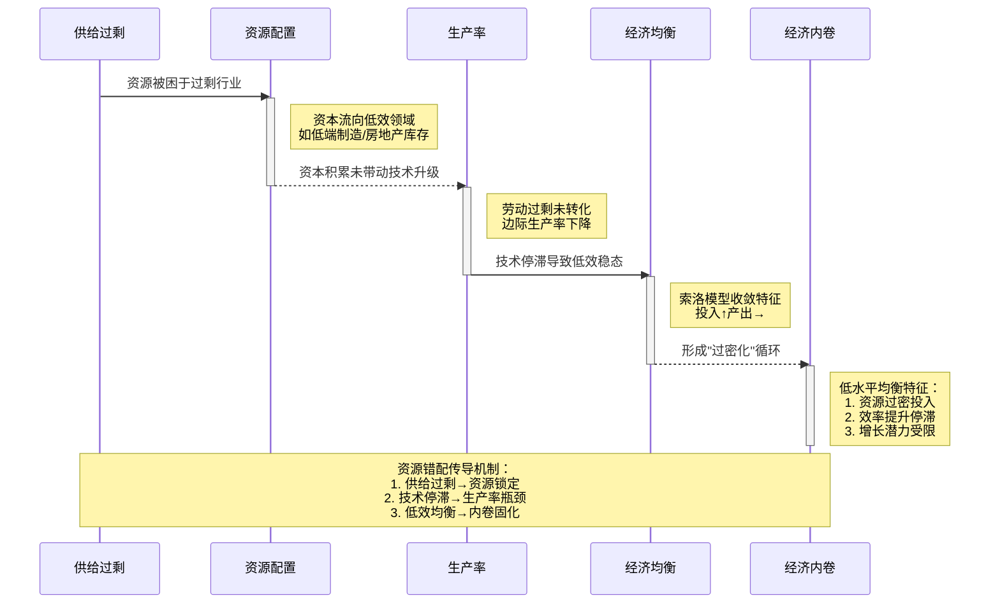
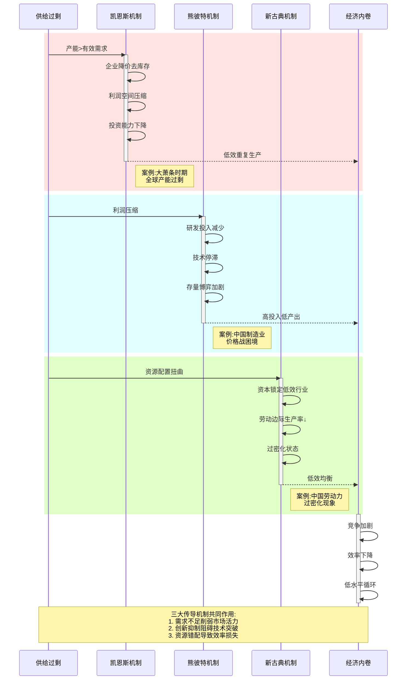

 **供给过剩是经济内卷的重要根源**
----

 **引言**

“经济内卷”作为近年来广受关注的术语，描述了经济发展中过度竞争与低效循环并存的现象，尤其在中国快速工业化背景下，与供给过剩问题交织显现。经济内卷（Involution）指经济发展停滞于高投入低产出的状态，而供给过剩（Overcapacity）则表现为商品或服务供应超出市场需求，导致资源浪费和市场失衡。本文旨在探讨“供给过剩是经济内卷的重要根源”这一命题，分析其理论依据、作用机制及实证支持，揭示两者间的内在逻辑，并提出解决路径。

本文首先界定经济内卷与供给过剩的概念；其次构建理论框架，引入凯恩斯主义、熊彼特创新理论和新古典增长理论，阐释两者关联；再次剖析供给过剩触发内卷的机制，强化因果逻辑；随后通过案例验证假设；最后提出政策建议并总结。本研究结合理论与实证，旨在为理解和破解内卷困局提供系统视角。

 **一、经济内卷与供给过剩：概念界定与特征**

 **1.1 经济内卷的定义与特征**

 **定义**

“经济内卷”这一概念最早由人类学家Clifford Geertz于1963年提出，用以描述农业社会中一种特定的经济现象：即劳动投入不断增加，但产出却未能实现相应提升的情形。这一现象在传统农业社会中尤为明显，例如农民通过增加劳动时间和人力投入来维持生计，但单位产出并未显著增长。在现代语境中，经济内卷的概念被进一步扩展，经济学家Vollrath（2018）将其定义为一种经济发展停滞的状态，即社会或经济体因过度竞争和边际收益递减而陷入低效循环。简而言之，经济内卷不仅局限于农业领域，而是广泛适用于描述现代社会中资源分配失衡和效率下降的现象。

 **特征**

经济内卷的表现形式多样，其核心特征可以归纳为以下几个方面：

 **1. 过度竞争**

过度竞争是经济内卷最显著的特征之一。在资源有限的环境下，企业、个体乃至整个行业为争夺市场份额或生存空间，展开非理性的激烈竞争。这种竞争往往不以创新或效率提升为目标，而是以短期利益为导向。例如，在中国教育领域，应试教育的内卷现象尤为突出：学生和家长投入大量时间、金钱和精力于课外补习和考试准备，但整体教育质量和社会流动性并未因此显著改善。这种竞争不仅加剧了资源浪费，也使得参与者疲惫不堪。

 **2. 边际收益递减**

边际收益递减是经济内卷的另一个关键特征。当资源投入（如时间、资金或劳动力）持续增加时，产出的增长速度却逐渐放缓，甚至停滞。例如，在农业过密化的案例中，农民可能通过增加耕作时间或化肥使用量来提高产量，但土地的承载能力有限，最终导致单位投入的回报显著下降。这种现象在现代经济中同样存在，如企业过度依赖低成本劳动力而忽视技术升级，最终陷入增长瓶颈。

 **3. 资源过密化**

资源过密化指的是在资源稀缺的条件下，投入却无节制地增加，导致资源利用效率低下和浪费加剧。例如，在一些发展中国家，城市化进程中人口大量涌入有限的就业市场，但工作岗位的增长速度远不及人口增长，导致就业竞争加剧、工资水平下降。这种资源分配失衡的现象进一步加深了内卷的程度，使经济活动难以实现可持续发展。

 **4. 重复性劳动**

经济内卷还表现为经济活动中创新的缺失，参与者往往陷入低水平的重复性劳动循环。以制造业为例，一些企业为了维持竞争力，选择不断压低成本、延长工时，而非投资于技术研发或产品升级。这种缺乏创造性的经济模式使得整个行业停滞于低附加值阶段，难以突破发展瓶颈。

 **5. 社会心理影响**

经济内卷不仅影响经济效率，还对社会心理产生深远影响。长期的过度竞争和低回报使得个体普遍感到焦虑、疲惫甚至绝望。例如，Ji（2021）的研究指出，在内卷化的社会环境中，人们对未来的不信任感显著增强，年轻人尤其容易产生“躺平”或“摆烂”的消极态度。这种心理状态反过来又进一步削弱了社会创新和经济活力，形成恶性循环。

**经济内卷**作为一种复杂的经济社会现象，既是资源分配失衡的结果，也是竞争模式低效的体现。其特征——过度竞争、边际收益递减、资源过密化、重复性劳动以及社会心理影响——在不同领域和文化背景下均有不同程度的体现。要摆脱内卷的困境，需要从制度设计、创新驱动和社会心理调适等多方面入手，以实现资源的高效利用和经济的可持续发展。

 **1.2 供给过剩的定义与表现**

 **定义**

供给过剩是指市场中商品或服务的供应量显著超过实际需求量，导致资源无法有效配置和利用的现象。根据Wall Street Mojo（2023）的描述，这种失衡状态通常伴随着库存积压、价格下跌以及资源闲置等后果。供给过剩不仅反映了生产与消费之间的脱节，也可能源于市场预测失误、过度投资或经济结构调整等深层原因。在现代经济中，供给过剩既可能出现在单一行业，也可能波及整个经济体系，成为经济运行中的重要挑战。

 **表现**

供给过剩的具体表现形式多样，涵盖经济活动的多个层面，其主要特征包括以下几个方面：

 **库存积压**

库存积压是供给过剩最直接的表现之一。当生产的产品或服务无法被市场及时消化时，企业往往面临货物堆积的困境。以中国房地产市场为例，近年来部分城市的房屋库存持续高企，大量新建住宅无人购买，导致开发商资金链紧张。这种现象不仅浪费了资源，也对相关产业链造成了负面影响。

 **价格下跌**

为了清空库存或抢占市场份额，企业常常采取降价策略，从而引发价格下跌。然而，这种竞争性降价往往压缩了企业的利润空间，甚至导致恶性竞争。例如，在某些消费品行业，厂商为应对供过于求的局面而大幅降价，最终使得整个行业的盈利能力下降，难以维持长期发展。

 **产能闲置**

供给过剩还表现为生产能力的未充分利用，即产能闲置。在需求不足的情况下，工厂可能被迫减产甚至停工，机器设备和人力资源处于闲置状态。例如，在全球经济放缓时期，部分制造业企业因订单减少而无法满负荷运转，导致资源浪费和生产效率低下。

 **失业增加**

劳动力市场的过剩是供给过剩的另一重要体现。当企业因市场需求不足而削减生产时，往往伴随着裁员或招聘冻结，从而推高失业率。这种现象进一步加剧了社会竞争压力，例如在经济下行周期中，求职者数量激增而岗位有限，导致就业市场的“内卷化”趋势加剧。

 **结构性过剩**

供给过剩并非均匀分布，而是常常呈现结构性特征，即某些领域供给严重过剩，而其他领域供给不足。例如，在一些经济体中，低端制造业产品过剩，市场充斥着廉价、低质商品；而高端技术产品或创新服务的供给却明显不足。这种结构性失衡不仅限制了经济转型升级，也加剧了资源配置的低效。

**供给过剩** 作为一种普遍的经济现象，既是市场失衡的结果，也可能成为经济危机的导火索。其表现形式——**库存积压**、**价格下跌**、**产能闲置**、**失业增加**以及**结构性过剩**——在不同行业和经济环境中均有体现。要缓解供给过剩的压力，需要通过优化产业结构、提升需求预测能力以及推动创新供给等措施，实现供需的动态平衡。

----

 **二、理论框架：供给过剩与内卷的内在逻辑**

为阐明供给过剩如何成为经济内卷的根源，本节引入多重理论视角，构建逻辑链条：
供给过剩→市场失衡→资源错配与竞争加剧→创新抑制与效率下降→内卷化。

 **2.1 凯恩斯主义：有效需求不足与过剩循环**

 **理论基础**

英国经济学家约翰·梅纳德·凯恩斯（John Maynard Keynes）在其1936年出版的《就业、利息和货币通论》中提出，有效需求是决定经济均衡的核心因素。凯恩斯认为，经济的运行并非由供给自动创造需求，而是由实际购买力支撑的消费和投资需求驱动。当有效需求不足时，市场无法吸收全部供给，导致供给过剩的现象。具体而言，供给过剩源于需求疲软，使得生产能力未能充分利用，进而引发库存积压和价格下跌。这种失衡不仅影响企业的正常运营，也对整个经济体系造成深远冲击。

 **供给过剩的经济后果**

在凯恩斯的框架下，供给过剩并非短暂的市场波动，而是可能引发恶性循环的起点。当企业面临需求不足时，为消化过剩产能，往往选择降价竞争以清空库存。然而，降价虽然短期内可能刺激销量，却大幅压缩了企业的利润空间。利润减少直接削弱了企业进行再投资的能力，导致生产设备更新和技术创新的资金不足。与此同时，投资减少进一步抑制了市场需求，形成“需求萎缩—供给过剩加剧—利润下降—投资减少”的恶性循环。这种循环效应在大萧条时期尤为明显，当时全球范围内的生产过剩未能被有效需求吸收，导致经济陷入长期停滞，甚至失业率飙升、社会动荡加剧。

 **供给过剩与经济内卷的内在联系**

 **高投入低产出的特征吻合**

供给过剩与经济内卷之间存在显著的逻辑关联，二者共享“高投入低产出”的核心特征。经济内卷描述了资源投入不断增加但产出增长停滞的状态，而供给过剩同样表现为生产能力的过度扩张未能带来相应的市场需求增长。例如，企业为维持市场份额而增加产量或延长工时，却因需求不足而无法实现利润提升，这种努力最终沦为低效甚至无效的重复性劳动。这种现象与内卷的“边际收益递减”和“重复性劳动”特征高度契合。

 **逻辑递进：从供给过剩到内卷**

供给过剩如何演变为经济内卷，可以通过以下逻辑递进加以分析：

1. **供给过剩削弱有效需求**  
   当市场供过于求时，产品无法及时销售，企业收入减少，消费者的购买力随之下降。这种有效需求的萎缩使得经济活动失去增长动力，为内卷埋下隐患。

2. **企业为生存加剧竞争**  
   面对需求不足，企业为维持生存往往选择加剧竞争，例如通过降价、增加广告投入或延长生产时间来争夺有限的市场份额。然而，这种竞争更多是零和博弈，未能创造新的价值，反而加剧了资源浪费。

3. **资源未转化为创新动力**  
   在利润被压缩、投资能力下降的情况下，企业缺乏资金和动力进行技术升级或产品创新。资源被困于低效的重复性生产中，无法转化为推动经济发展的创新动能。

4. **内卷的形成**  
   上述过程最终导致经济陷入内卷状态：高强度的投入与低水平的产出并存，社会资源被过度消耗却未能带来整体福祉的提升。例如，中国某些行业的“996”工作制虽然增加了劳动时间，但产出效率和员工幸福感并未显著提高，反而加剧了社会心理压力。

 **历史案例：大萧条的启示**

大萧条（1929-1939）是供给过剩与内卷相互作用的典型案例。在20世纪20年代，美国工业生产能力迅速扩张，但工资增长滞后、贫富差距扩大导致有效需求不足。1929年经济危机爆发后，过剩产能未能被市场吸收，企业纷纷降价抛售，利润大幅缩水，投资和消费需求进一步萎缩。最终，经济陷入停滞，失业率一度高达25%，社会资源被大量闲置。这种“高投入低产出”的困境与内卷特征不谋而合，凸显了供给过剩若不及时化解，可能演化为系统性经济危机的风险。

**凯恩斯的有效需求理论** 为理解供给过剩提供了重要视角，而其与经济内卷的关联则进一步揭示了现代经济中的深层矛盾。供给过剩通过削弱需求、加剧竞争并抑制创新，逐步演化为内卷状态，使经济体系陷入低效循环。要打破这一恶性循环，需要从提升有效需求、优化资源配置和推动创新驱动入手，以实现经济的可持续发展。

 **2.2 熊彼特创新理论：过剩抑制创造性破坏**

 **理论基础**

奥地利经济学家约瑟夫·熊彼特（Joseph Schumpeter）在其1942年出版的《资本主义、社会主义与民主》中提出，经济增长的根本动力源于创新驱动的“创造性破坏”。熊彼特认为，经济并非通过简单的资源积累实现发展，而是依赖技术进步、企业家精神和产业革命打破旧有格局，创造新的生产方式和市场机会。这种“创造性破坏”不仅淘汰低效的生产结构，还通过创新重塑经济体系，推动长期繁荣。熊彼特强调，创新是经济增长的引擎，而缺乏创新的经济体将不可避免地陷入停滞。

 **创新与供给过剩的矛盾**

熊彼特的理论为分析供给过剩提供了一个独特的视角。在供给过剩的环境中，市场供过于求导致企业利润率下降，研发投入受到严重压缩。由于创新活动（如技术研发、新产品开发）需要长期资金支持和高风险承受能力，利润的减少直接削弱了企业进行技术突破的能力。尤其在过剩行业中，企业为维持生存往往倾向于短期策略，例如降价竞争或增加产量，而非投资于不确定的创新项目。这种行为不仅阻碍了“创造性破坏”的发生，还使经济停留在低效状态。

 **供给过剩如何抑制创新并导致内卷**

 **特征契合：低水平循环**

供给过剩与经济内卷的“低水平循环”特征高度一致。在熊彼特的框架下，创新是打破低效循环的关键，而供给过剩却通过压缩利润和削弱研发动力，阻碍了这一过程。例如，在低端制造业领域，过剩产能导致企业陷入存量博弈，竞争焦点集中在成本压低和产量扩张，而非技术升级或产品差异化。这种重复性竞争不仅未能提升行业整体效率，反而使资源被困于低附加值活动中，与内卷的“高投入低产出”模式如出一辙。

 **逻辑递进：从供给过剩到内卷**

供给过剩如何通过抑制创新演变为经济内卷，可以通过以下逻辑递进加以剖析：

1. **供给过剩降低利润率**  
   当市场供过于求时，企业为消化库存或抢占市场份额被迫降价，导致利润率显著下降。这种盈利能力的削弱限制了企业可用于研发和创新的资金来源。例如，在全球钢铁行业，过剩产能曾导致价格战频发，许多企业无力投入新材料研发。

2. **企业倾向于维持现状而非创新**  
   在利润微薄的压力下，企业往往选择保守策略，优先确保生存而非冒险创新。熊彼特眼中的企业家精神——敢于承担风险推动技术进步的动力——被短期生存需求所取代。例如，一些传统制造业企业宁愿延长工时、压低工资，也不愿冒险开发新技术或新市场。

3. **技术停滞固化过剩结构**  
   缺乏创新使得过剩行业的生产方式和技术水平难以突破，过剩结构因此被固化。低端产品继续大量生产，而高端供给的缺口无法填补。这种结构性失衡进一步加剧供需矛盾，使经济难以通过“创造性破坏”实现转型升级。

4. **内卷的加剧**  
   上述过程最终导致经济陷入内卷状态：资源被大量投入重复性、低效的生产活动中，产出却无法匹配投入的增长。社会整体创新能力下降，经济增长动力被耗竭。例如，中国某些低端制造业领域因长期缺乏技术突破，陷入了“价格战”和“低水平竞争”的内卷循环。

 **现实案例：低端制造业的困境**

以中国低端制造业为例，供给过剩与内卷的关联尤为明显。过去几十年，大量企业依赖廉价劳动力和规模化生产参与全球竞争，但随着市场需求饱和，低端产品过剩问题日益严重。企业为维持市场份额，普遍采取降价和增产策略，却很少投资于自动化技术或高端产品研发。这种策略短期内保住了部分订单，但长期来看，利润微薄和技术停滞使得行业整体竞争力下降。工人加班加点、企业疲于奔命，却无法摆脱低附加值的循环，充分体现了内卷的特征。

**熊彼特的“创造性破坏”理论** 揭示了创新在经济增长中的核心作用，而供给过剩通过压缩利润、抑制研发和固化过剩结构，阻碍了这一过程，最终将经济推向内卷的深渊。从**降低利润率**到**维持现状**，再到**技术停滞**和**内卷加剧**，这一逻辑链条清晰地勾勒出供给过剩与经济停滞的内在联系。要摆脱这一困境，需通过政策引导企业加大创新投入，推动产业升级，以重塑经济增长的动力源泉。

 **2.3 新古典增长理论：资源配置效率下降**

 **理论基础**

美国经济学家罗伯特·索洛（Robert Solow）在其1956年发表的《经济增长理论》中提出了新古典增长模型，强调经济增长源于资本积累、劳动投入和技术进步三大要素的协同作用。在索洛模型中，经济的长期增长主要依赖技术进步，而资本和劳动的边际生产率决定了资源的有效配置。如果资源配置失衡，例如资本和劳动未被技术有效吸纳，边际生产率将下降，经济增长动力随之减弱。新古典理论为分析供给过剩与经济效率的关系提供了一个重要框架。

 **供给过剩下的资源错配**

在供给过剩的环境中，市场供过于求导致资源无法按照效率最优的原则进行配置。资本可能过度集中于低效或过剩行业，劳动则因需求不足而未被充分利用，技术进步的推动作用也因缺乏投资而受阻。这种资源错配降低了整体经济的边际生产率，使增长潜力无法充分发挥，与新古典增长理论的理想状态背道而驰。

 **供给过剩如何导致内卷**

 **特征契合：过密化**

供给过剩与经济内卷的“过密化”特征高度吻合。内卷中的“过密化”指的是资源投入过度密集却未带来产出效率的提升，而供给过剩恰恰通过资源错配加剧了这一现象。例如，资本和劳动大量投入到低附加值领域，却因缺乏技术升级而无法提高生产率。这种低效配置使得经济运行陷入停滞，与索洛模型中技术驱动增长的逻辑形成鲜明对比。

 **逻辑递进：从供给过剩到内卷**

供给过剩如何通过资源错配演变为经济内卷，可以通过以下逻辑递进加以分析：

1. **供给过剩扭曲资源配置**  
   当市场供过于求时，资源未能流向高效率领域，而是被困于过剩行业。例如，资本可能持续投入到低端制造业或房地产库存积压的领域，而非新兴技术产业。这种扭曲使得资源无法发挥最大效用，经济整体效率下降。

2. **资本和劳动未转化为生产率提升**  
   在供给过剩的压力下，企业利润被压缩，缺乏资金进行技术研发或设备更新，导致资本积累未能带动生产率提高。同时，劳动过剩未被技术进步吸纳，大量劳动力滞留在低技能岗位，边际生产率持续下降。例如，中国部分地区劳动力过剩却未伴随自动化技术普及，生产效率难以提升。

3. **经济陷入低效均衡**
   资源错配和技术停滞共同作用，使经济趋向一种低效的稳态均衡。在这种状态下，资本和劳动的投入增加，但产出增长停滞，符合索洛模型中缺乏技术进步时的“收敛”特征。这种低效均衡限制了经济的长期发展潜力。

4. **内卷的表现**  
   上述过程最终导致经济内卷：资源被过度投入到低效领域，表现为“过密化”和“低水平循环”。社会付出高昂成本，却未能实现整体生产率的提升，经济增长被困于低效状态。

 **现实案例：中国劳动力过剩与技术滞后的困境**

中国经济中的某些现象为供给过剩与内卷的关联提供了现实注脚。在过去几十年中，劳动力供给充足推动了制造业的快速扩张，但随着市场需求饱和，低端制造业出现严重过剩。然而，由于资本更多流向传统行业而非技术研发，劳动过剩并未伴随技术升级。例如，许多工厂仍依赖人工重复劳动，而非引入自动化设备，导致边际生产率低下。这种“劳动力过密化”不仅浪费了人力资源，也使经济效率停滞，体现了内卷的典型特征。

**新古典增长理论** 通过资本、劳动和技术进步的互动，揭示了供给过剩对经济增长的负面影响。从**资源错配**到**生产率停滞**，再到**低效均衡**和**内卷化**，供给过剩扭曲了资源配置逻辑，使经济陷入低水平循环。要摆脱这一困境，需通过政策引导资本流向技术创新领域，提升劳动技能水平，推动技术进步，以实现资源的高效配置和经济的可持续发展。

 **2.4 内卷经济学与马尔萨斯陷阱**

 **内卷经济学：资源过剩的非理性投入**

经济学家迪特里希·沃尔拉斯（Dietrich Vollrath）在2018年的研究中提出，内卷经济学关注资源过剩如何因非理性投入导致效率下降。他以教育为例指出，当资源（如时间、资金）过度投入到应试竞争而非知识创新时，整体教育质量并未提升，反而陷入低效循环。这种“高投入低产出”的状态，正是内卷的核心特征，与供给过剩下资源未被有效利用的困境高度一致。

 **马尔萨斯陷阱：承载极限与技术停滞**

马尔萨斯陷阱（Malthusian Trap）由托马斯·马尔萨斯提出，后经黄宗智（Philip Huang）和罗泽尔（Scott Rozelle）等学者于1996年进一步发展，揭示了人口或生产能力超过资源承载能力时，若技术未实现突破，经济将陷入停滞甚至倒退。在供给过剩的情境中，生产能力超出市场需求，类似马尔萨斯陷阱中的资源超载，而技术停滞则使得过剩无法通过效率提升化解，二者共同为内卷的形成提供了理论支持。

 **供给过剩触发内卷的综合逻辑**

供给过剩作为内卷的根源，通过凯恩斯、熊彼特和新古典增长理论三大渠道，系统性地推动经济效率下降和低水平循环的形成。以下是综合逻辑的递进分析：

 **渠道一：需求不足（凯恩斯视角）**

凯恩斯的有效需求理论指出，供给过剩源于需求疲软，导致市场无法吸收过剩产能。企业为清库存降价竞争，利润缩水削弱再投资能力，形成“需求萎缩—供给过剩加剧—投资减少”的恶性循环。这种循环使资源被困于低效重复生产，与内卷的“低水平循环”特征一致。例如，大萧条时期需求不足导致全球产能过剩，经济陷入长期停滞。

 **渠道二：创新抑制（熊彼特视角）**

熊彼特的“创造性破坏”理论强调创新是经济增长的引擎，而供给过剩通过压缩利润抑制研发投入，阻碍技术突破。企业为生存倾向于维持现状而非冒险创新，导致技术停滞固化过剩结构。例如，低端制造业因存量博弈陷入价格战，创新动力不足，资源被耗费于低效竞争，加剧内卷的“高投入低产出”困境。

 **渠道三：资源错配（新古典视角）**

新古典增长理论（索洛模型）认为，经济增长依赖资本、劳动和技术进步的协同作用。供给过剩扭曲资源配置，使资本集中于低效行业，劳动过剩未被技术吸纳，边际生产率下降。这种低效配置导致经济陷入“过密化”状态，例如中国劳动力过剩未伴随技术升级，效率低下，体现了内卷的低效均衡特征。

 **综合效应：竞争加剧与效率下降**

三大渠道相互交织，共同推动内卷的形成：
1. **需求不足**削弱市场活力，企业为争夺有限需求加剧竞争。
2. **创新抑制**使竞争停留于低水平重复，无法通过技术突破化解过剩。
3. **资源错配**加剧低效投入，资本和劳动被困于无意义的“存量博弈”。

最终，经济在高强度竞争中效率持续下降，表现为内卷的“低水平循环”。例如，中国教育领域的应试竞争（内卷经济学）和传统农业的劳动力过密化（马尔萨斯陷阱）均反映了这一过程。

 **案例分析：中国教育的内卷化**

中国教育领域为供给过剩触发内卷提供了典型例证。随着教育资源投入增加（如补习班、培训机构激增），学生和家长的努力集中于应试而非综合能力提升。教育供给过剩（培训机构泛滥）未带来整体质量提高，反而加剧竞争压力，导致“高投入低产出”的内卷状态。这与凯恩斯的需求不足（教育资源未转化为实际需求）、熊彼特的创新抑制（缺乏教学模式突破）和新古典的资源错配（时间精力集中于低效竞争）逻辑一致。

**供给过剩** 通过**需求不足**（凯恩斯）、**创新抑制**（熊彼特）和**资源错配**（新古典）三大渠道，触发竞争加剧和效率下降，最终形成内卷。内卷经济学和马尔萨斯陷阱进一步补充了资源过剩与技术停滞的视角，强化了这一假设。要打破内卷循环，需从提升有效需求、激励创新和优化资源配置入手，推动经济向高效、可持续的方向转型。

----

 **三、供给过剩触发经济内卷的机制**

供给过剩作为经济内卷的触发因素，通过一系列相互关联的机制逐步将经济推向低效循环。以下基于“过剩→失衡→竞争→低效”的逻辑链条，结合凯恩斯、熊彼特、新古典增长理论、内卷经济学和马尔萨斯陷阱的视角，系统剖析这一过程。

 **第一步：过剩——供给超出需求的基础状态**

供给过剩的根源在于生产能力显著超越了市场的实际需求，导致资源无法被有效吸收和利用。这种现象在经济学中通常被视为一种结构性失衡，表现为商品、服务或生产要素（如资本和劳动力）的供给远超需求端的消化能力。在凯恩斯主义的视角下，这一状态被归因于有效需求的不足。凯恩斯认为，经济的健康运行依赖于消费、投资和政府支出的总和来匹配生产能力。然而，当需求疲软时，企业生产的商品或服务无法全部转化为实际的购买力，过剩的产品便以库存积压的形式堆积。这种情况不仅增加了企业的运营成本，还削弱了市场信心。例如，全球光伏产业近年来因政策刺激和技术进步推动产能快速扩张，但市场需求未能同步增长，导致供过于求的局面日益严峻。光伏组件价格持续下滑，企业利润空间被大幅压缩，甚至出现部分厂商亏损退出市场的现象。

与此同时，熊彼特的“创造性破坏”理论为供给过剩的后果提供了更深层次的解读。他认为，经济增长的核心在于通过技术创新和产业升级来消化过剩产能并创造新的需求。然而，当供给过剩发生时，企业往往面临利润下降的压力，研发和创新的资金投入随之减少。这种资源约束削弱了企业突破技术瓶颈、开发新产品或开拓新市场的动力，反而促使它们陷入维持现状的被动状态。例如，在光伏行业中，部分企业因市场饱和而放弃了对高效电池技术的研发，转而依赖低价竞争来消化库存。这种短期策略虽然暂时缓解了库存压力，却进一步抑制了行业整体的技术进步，形成“过剩—创新停滞—过剩加剧”的恶性循环。

此外，供给过剩还可能受到外部因素的放大，例如政策导向或全球化的影响。在政策驱动下，某些行业可能因过度补贴而盲目扩大产能，而全球贸易中的供需失衡则可能加剧局部市场的过剩压力。以中国钢铁行业为例，过去十年的产能扩张曾导致全球市场供过于求，价格暴跌迫使企业以降价求存，最终陷入低效竞争的泥潭。熊彼特理论在此提醒我们，若不能通过创新打破这种过剩格局，经济将逐步滑向资源浪费和技术停滞的困境，为后续的失衡和内卷埋下伏笔。因此，供给过剩不仅是需求的短期不足，更是创新能力受抑制的长期隐患，成为推动内卷化进程的起点。

 **第二步：失衡——资源配置与市场结构的扭曲**

供给过剩不仅停留在生产与需求的不匹配上，更深远的后果是它引发的资源配置失衡。这种失衡表现为资本、劳动力和技术等关键生产要素无法按照效率最优的原则在经济体系中流动，从而扭曲了市场结构和产业布局。新古典增长理论，特别是索洛模型，提供了一个分析框架：经济的长期增长依赖于资本积累、劳动力投入和技术进步之间的动态平衡。然而，在供给过剩的环境下，这种平衡被打破。资本往往被错误地引导至已经饱和或低效的行业，而非流向高生产率或创新潜力更大的领域。例如，在中国某些传统制造业（如纺织或低端机械制造），资本持续投入到技术含量低、附加值有限的生产线中，而非用于升级设备或研发新技术。与此同时，劳动力市场也因需求不足而出现过剩，大量工人被困在低技能岗位，未能通过培训或产业升级被自动化技术和新兴行业吸纳。这种资源错配直接导致边际生产率的下降，经济整体效率随之受损。

进一步看，这种失衡还与技术进步的停滞密切相关。新古典理论强调技术进步是提升生产率的关键，但在供给过剩的压力下，企业因利润缩水而削减研发投入，技术升级的步伐放缓甚至停滞。例如，中国部分制造业企业在面对产能过剩时，选择维持既有生产模式而非投资智能化生产线，结果是劳动生产率长期徘徊在低水平。与此同时，马尔萨斯陷阱的逻辑为这一现象提供了历史视角：当生产能力超过资源承载极限（如市场需求或自然资源）时，若技术无法突破瓶颈，经济便陷入一种“高投入、低产出”的失衡状态。历史上，农业社会因土地资源有限而导致的人口过剩与生产停滞，正是这种陷阱的体现；而在现代经济中，过剩的工业产能同样可能因技术停滞而加剧失衡。例如，全球钢铁行业曾因需求萎缩和技术更新缓慢，导致大量资本和劳动力被困于低效生产环节，资源配置的扭曲愈发明显。

此外，市场结构的扭曲进一步放大了失衡的效应。在供给过剩的背景下，行业集中度可能下降，小型企业为生存而分散资源，而大型企业则可能因缺乏竞争压力而丧失创新动力。这种碎片化的市场结构削弱了资源整合的能力。例如，中国某些地区的地方保护主义导致重复建设，多个企业生产同质化产品，资本和劳动力被分散投入到低效项目中，而非集中于规模经济或技术领先的领域。这种现象不仅降低了资源利用效率，还为后续的恶性竞争埋下了伏笔。马尔萨斯陷阱的现代诠释在此尤为贴切：当经济体系的承载能力（如市场需求）无法支撑过剩的生产能力时，技术停滞使得失衡从暂时现象演变为结构性问题，最终推动经济向低效和内卷的方向滑行。

 **第三步：竞争——存量博弈下的资源内耗**

资源配置的失衡不仅削弱了经济的整体效率，还将企业推入了一种存量博弈的激烈竞争状态。在这一阶段，市场从追求“增量创造”转向了“存量争夺”，竞争的本质发生了根本性转变。凯恩斯主义的框架为这种现象提供了直观的解释：当有效需求不足时，市场容量无法容纳过剩的供给，企业为了生存被迫通过降价、增产或营销手段抢占有限的市场份额。这种策略虽然短期内可能维持企业的现金流，却不可避免地引发恶性竞争。例如，在中国低端制造业领域，诸如服装加工或基础建材行业，厂商往往通过大幅压低价格来争夺订单，导致利润率被压缩到微乎其微的水平。这种竞争不仅未能为行业带来新的增长点，反而使资源被大量耗费于低效甚至无意义的重复生产中，经济活力因此逐步枯竭。

熊彼特的“创造性破坏”理论则从创新的角度揭示了竞争恶化的深层原因。在理想状态下，竞争应推动企业通过技术创新或产品升级来开辟新市场、创造新需求。然而，在供给过剩和资源失衡的背景下，创新的动力被显著抑制。企业因利润空间狭窄而减少研发投入，不愿冒险开发新产品或探索未知领域，而是选择依赖成本压缩、模仿生产或低价策略来维持生存。例如，全球电子消费品市场中的低端产品线，厂商往往通过削减材料成本或延长现有生产线寿命来应对竞争，而非投资于下一代技术。这种低水平的竞争不仅未能推动产业升级，反而将资源进一步锁定在重复性、低附加值的活动中，形成一种“技术停滞—利润萎缩—竞争加剧”的恶性循环。

内卷经济学的“过密化”特征在此尤为突出。所谓“过密化”，指的是资源投入的密度不断增加，但并未带来相应的效率提升或产出增长。在存量博弈的竞争中，企业为了争夺有限的市场份额，往往不惜投入更多资本、劳动力和时间，却仅换来微不足道的回报。例如，在中国某些地区的农业机械制造行业，企业重复生产低端机型，市场充斥着功能相似但价格低廉的产品，厂商之间陷入无休止的价格战。这种高强度的资源投入并未推动技术进步或市场扩展，反而导致资源的严重内耗，整个行业陷入一种“忙碌却无成果”的困境。类似的现象在服务行业也屡见不鲜，如外卖平台的补贴大战，虽然短期内吸引了用户，却因长期低价竞争而使企业利润受损，最终资源被消耗在无意义的流量争夺中。

更值得注意的是，这种存量博弈下的竞争还可能引发外部效应，进一步加剧资源浪费。在全球化背景下，国内企业的恶性竞争可能波及国际市场，例如通过倾销策略输出过剩产能，导致全球价格体系紊乱。以光伏行业为例，中国厂商的低价竞争曾一度压低全球光伏组件价格，虽然短期内扩大了市场份额，却也使得许多企业无力投入研发高效技术，行业整体创新能力受挫。这种内耗式竞争不仅削弱了企业的长期竞争力，还为经济的内卷化进程埋下了更深的隐患。由此可见，存量博弈下的资源内耗不仅是效率低下的表现，更是创新停滞和市场活力丧失的直接推手。

 **第四步：低效——内卷化的最终表现**

竞争加剧的存量博弈将经济推向效率持续下降的境地，最终形成内卷化的低效均衡状态。这种状态不仅是资源配置失衡和恶性竞争的必然结果，更是创新停滞和技术突破缺失的综合体现。新古典经济增长理论对此提供了清晰的分析框架：在资源错配和技术进步停滞的双重作用下，经济逐渐趋向一种低生产率的稳态。此时，资本、劳动等要素的投入增加无法带来相应的产出增长，边际收益递减效应显著。例如，在中国一些传统制造业领域，大量资金和劳动力被投入到重复建设的低端生产线中，但由于市场需求饱和和技术含量低，产值增长远低于投入增速。这种“高投入、低产出”的模式使得经济效率持续下滑，资源被困在低效利用的恶性循环中。

熊彼特的“创造性破坏”理论进一步揭示了低效均衡的深层根源。在健康的经济发展中，创新是打破过剩结构、推动产业升级的关键驱动力。然而，当竞争停留于低水平、利润空间被压缩时，企业缺乏资金和动力进行研发，创新的缺失使得过剩产能无法被有效消化。例如，在全球纺织行业中，许多企业因市场饱和而放弃对新型纤维材料或智能制造技术的探索，转而依赖廉价劳动力和既有设备维持生产。这种选择虽然短期内降低了成本，却固化了过剩的生产结构，使行业整体陷入低效竞争的泥潭。熊彼特所强调的“破坏性创新”未能发生，取而代之的是资源的重复投入和市场活力的逐步丧失，最终导致经济无法摆脱内卷化的宿命。

内卷经济学的视角则通过具体案例进一步阐释了这种低效状态。以教育领域为例，中国部分地区的应试教育模式展现了典型的“过密化”特征：学生和家庭投入大量时间、精力和金钱用于考试准备，但整体教育质量和创新能力的提升却微乎其微。这种高强度的资源投入并未转化为社会生产力的实质性增长，反而形成了“过度努力、低效产出”的内卷格局。类似的现象也在其他行业中普遍存在，例如某些服务业的过度营销竞争，企业耗费巨资争夺用户，却未能改善服务质量或开发新市场。这种内卷化的低效不仅浪费了资源，还削弱了经济体系的长期发展潜力。

马尔萨斯陷阱的逻辑在此同样适用，为低效均衡提供了历史与理论的双重警示。当生产能力超过资源承载极限（如市场需求或技术水平）时，若技术无法实现突破，过剩的资源投入不仅无法推动增长，反而可能导致停滞甚至倒退。例如，历史上农业社会因土地资源有限而陷入人口过剩与生产力停滞的困境；而在现代经济中，工业和服务业的产能过剩同样因技术瓶颈而固化为低效状态。以光伏行业为例，尽管中国厂商在全球市场占据主导地位，但由于高效电池技术的研发滞后，许多企业仍依赖低端产品竞争，导致资源大量投入却仅换来微薄回报。这种“技术未突破、资源空耗”的局面，正是马尔萨斯陷阱在当代的映射。

最终，经济陷入一种“高投入低产出”的内卷循环，低效成为过剩、失衡和竞争恶化的必然归宿。在这一状态下，资源被持续消耗于重复性、低附加值的活动中，创新停滞使得经济无法突破现有格局。新古典理论的低生产率稳态、熊彼特的创新缺失、内卷经济学的过密化以及马尔萨斯陷阱的停滞逻辑，共同勾勒出内卷化的完整图景。这种低效均衡不仅是经济效率下降的表现，更是社会资源浪费和增长潜力枯竭的最终写照。

 **综合逻辑链条**

- **过剩**：供给超出需求，市场无法消化产能（如光伏行业过剩）。
- **失衡**：资源错配，资本和劳动集中于低效领域（如低端制造业技术滞后）。
- **竞争**：存量博弈加剧，企业陷入低水平竞争（如价格战）。
- **低效**：效率下降，经济表现为内卷化（如教育应试化）。

供给过剩通过“过剩→失衡→竞争→低效”的逻辑链条，推动经济内卷的形成。凯恩斯的需求不足揭示了过剩的起点，熊彼特的创新抑制解释了失衡的深化，新古典的资源错配剖析了竞争的根源，而内卷经济学与马尔萨斯陷阱则强化了低效的必然性。要打破这一循环，需通过刺激有效需求、激励技术创新和优化资源配置，重塑经济增长的动态平衡。

 **四、案例研究：供给过剩与内卷的实证验证**

 **4.1 历史案例：美国大萧条**

20世纪30年代，美国工业革命提升生产效率，但工资滞后导致需求不足（Britannica, 2023）。凯恩斯理论解释了过剩引发的通缩螺旋，企业裁员加剧竞争，经济陷入内卷式衰退。（ *详见前面发布的专题«房地产泡沫的终局:结构自锁和通缩循环»，下同。* ）

 **4.2 中国制造业与房地产**

中国中游制造业2021年起设备投资增长，但产能利用率下降，利润缩水（Oxford Economics, 2023）。房地产因政策导向高杠杆扩张，开发商降价竞争，行业微利化。新古典理论表明，资源错配固化低效结构。

 **4.3 新兴行业与劳动力市场**

光伏和新能源汽车因政策重复布局，技术竞争内卷化。劳动力过剩导致效率低下，如清代长江三角洲因人口压力技术停滞（Huang & Rozelle, 1996）。熊彼特理论显示，过剩抑制创新，加剧内卷。

 **五、解决路径与政策建议**

 **5.1 供给侧结构性改革**

- **淘汰落后产能**：通过市场化机制（如碳排放交易）优化供给，2016年钢铁行业去产能后利润回升（McKinsey, 2023）。
- **推动技术升级**：引导资源向高附加值领域倾斜，符合熊彼特创新驱动。

 **5.2 需求侧激励与分配改革**

- **扩大有效需求**：提高居民收入，释放消费潜力，契合凯恩斯理论。
- **劳动力市场改革**：灵活用工与技能培训，缓解结构性过剩。

 **5.3 政策协调与监管优化**

- **遏制重复建设**：建立统一大市场，减少地方保护主义。
- **行业自律**：防止恶性价格战，提升资源配置效率。

 **六、结论**

本文通过凯恩斯主义、熊彼特创新理论和新古典增长理论，论证了供给过剩作为经济内卷重要根源的逻辑：过剩导致市场失衡，资源错配和竞争加剧抑制创新，最终形成低效均衡。案例如美国大萧条和中国制造业过剩验证了这一因果链条。内卷的发生虽受多重因素影响，但供给过剩通过需求不足、创新停滞和效率下降直接推动其形成。未来需通过供需协同改革和技术突破，打破内卷循环，实现高质量发展。

---

 参考文献

1. Geertz, C. (1963). *Agricultural Involution: The Processes of Ecological Change in Indonesia*. University of California Press.
2. Keynes, J. M. (1936). *The General Theory of Employment, Interest and Money*. Macmillan.
3. Schumpeter, J. A. (1942). *Capitalism, Socialism and Democracy*. Harper & Brothers.
4. Solow, R. M. (1956). "A Contribution to the Theory of Economic Growth." *Quarterly Journal of Economics*, 70(1), 65-94.
5. Vollrath, D. (2018). "Involution and Growth." *Growth Economics Blog*. [growthecon.com/feed/2018/10/15/Involution.html](https://growthecon.com/feed/2018/10/15/Involution.html)
6. Ji, Y. (2021). "China’s 'Involuted' Generation." *The New Yorker*. [newyorker.com/culture/cultural-comment/chinas-involuted-generation](https://www.newyorker.com/culture/cultural-comment/chinas-involuted-generation)
7. Wall Street Mojo. (2023). "Overcapacity - What Is It, Causes, Examples, How To Overcome?" [wallstreetmojo.com/overcapacity/](https://www.wallstreetmojo.com/overcapacity/)
8. Deloitte Insights. (2023). "Global Impacts of Chinese Overcapacity." [deloitte.com/us/en/insights/economy/global-impacts-of-chinese-overcapacity.html](https://www2.deloitte.com/us/en/insights/economy/global-impacts-of-chinese-overcapacity.html)
9. Oxford Economics. (2023). "China's Overcapacity 'Problem' in Five Charts." [oxfordeconomics.com/resource/chinas-overcapacity-problem-in-five-charts/](https://www.oxfordeconomics.com/resource/chinas-overcapacity-problem-in-five-charts/)
10. Huang, P. C. C., & Rozelle, S. (1996). "The State and Economic Involution: Russia through a China Lens." *World Development*, 24(6), 1105-1117.
11. Investopedia. (2023). "Excess Capacity Definition, Causes, Impact, Example." [investopedia.com/terms/e/excesscapacity.asp](https://www.investopedia.com/terms/e/excesscapacity.asp)
12. McKinsey. (2023). "Profitability in a World of Overcapacity." [mckinsey.com/industries/oil-and-gas/our-insights/profitability-in-a-world-of-overcapacity](https://www.mckinsey.com/industries/oil-and-gas/our-insights/profitability-in-a-world-of-overcapacity)
13. Britannica. (2023). "Involution | Anthropological and Economic Theory." [britannica.com/topic/involution-anthropological-and-economic-theory](https://www.britannica.com/topic/involution-anthropological-and-economic-theory)