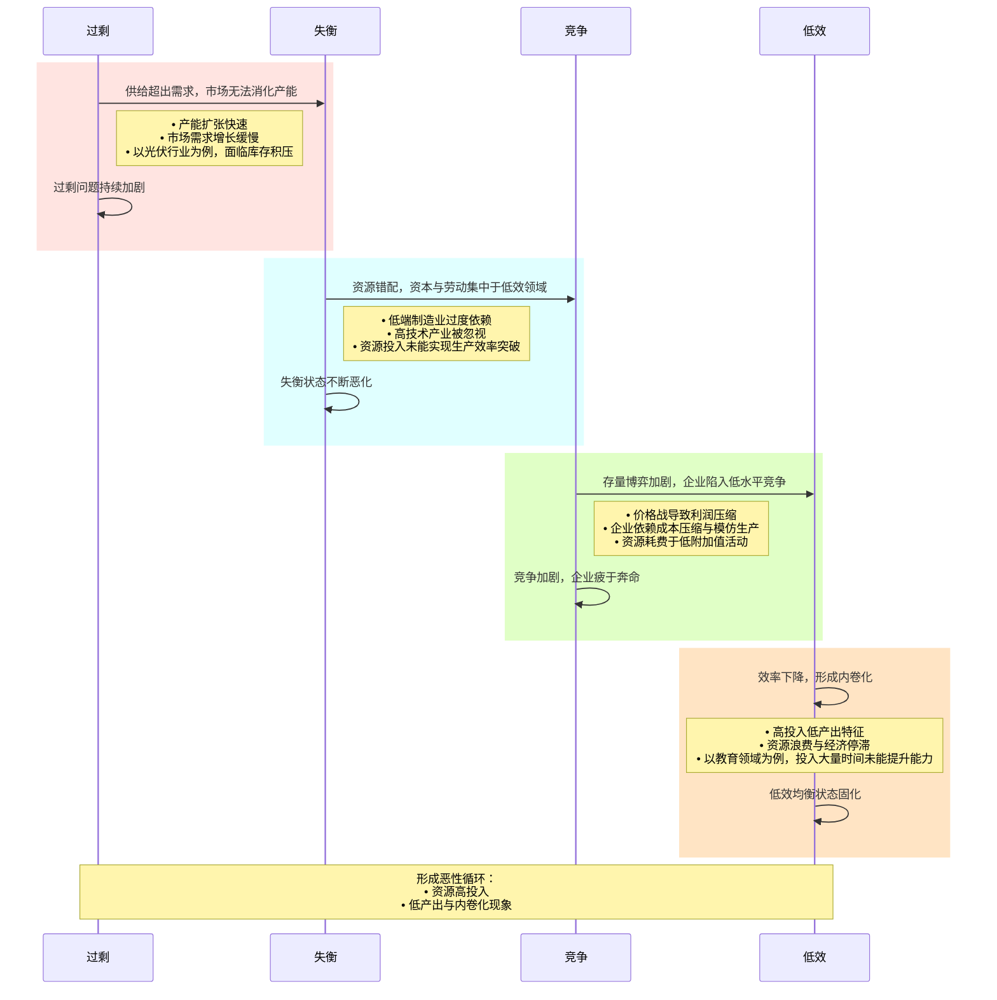

### 综合逻辑链条
----

```mermaid

sequenceDiagram
    participant 过剩
    participant 失衡
    participant 竞争
    participant 低效

    %% 阶段1：过剩
    rect rgb(255, 228, 225)
    过剩->>失衡: 供给超出需求，市场无法消化产能
    Note right of 过剩: • 产能扩张快速<br/>• 市场需求增长缓慢<br/>• 以光伏行业为例，面临库存积压
    过剩->>过剩: 过剩问题持续加剧
    end

    %% 阶段2：失衡
    rect rgb(224, 255, 255)
    失衡->>竞争: 资源错配，资本与劳动集中于低效领域
    Note right of 失衡: • 低端制造业过度依赖<br/>• 高技术产业被忽视<br/>• 资源投入未能实现生产效率突破
    失衡->>失衡: 失衡状态不断恶化
    end
    
    %% 阶段3：竞争
    rect rgb(224, 255, 198)
    竞争->>低效: 存量博弈加剧，企业陷入低水平竞争
    Note right of 竞争: • 价格战导致利润压缩<br/>• 企业依赖成本压缩与模仿生产<br/>• 资源耗费于低附加值活动
    竞争->>竞争: 竞争加剧，企业疲于奔命
    end
    
    %% 阶段4：低效
    rect rgb(255, 228, 196)
    低效->>低效: 效率下降，形成内卷化
    Note over 低效: • 高投入低产出特征<br/>• 资源浪费与经济停滞<br/>• 以教育领域为例，投入大量时间未能提升能力
    低效->>低效: 低效均衡状态固化
    end
    
    Note over 过剩,低效: 形成恶性循环：<br/>• 资源高投入<br/>• 低产出与内卷化现象


```

----
☞版权所有©2025 长征♛