## 1993年至2023年收入指标增长

```mermaid
---
config:
    xyChart:
        width: 1200
        height: 600
    themeVariables:
        xyChart:
            plotColorPalette: "#1f77b4, #ff7f0e, #2ca02c, #d62728, #9467bd"
---

xychart-beta
    title "1993-2023年度收入相关指标增长数据"
    x-axis "年度" [1993, 2003, 2013, 2023]
    y-axis "金额 (亿元/元)" 0 --> 1500000
    bar "国民总收入 (亿元)" [35599.2, 136576.3, 588141.2, 1249990.6]
    line "国内生产总值 (亿元)" [35673.2, 137422.0, 592963.2, 1260582.1]
    bar "财政收入 (亿元)" [4348.95, 21715.25, 129209.64, 216795.43]
    line "各项税收 (亿元)" [4255.30, 20017.31, 110530.70, 181136.25]
    bar "居民人均可支配收入 (元)" [1385, 5007, 18311, 39218]
```

### 图例说明：
*   ■ 国民总收入（柱状图）
*   ■ 国内生产总值（折线图）
*   ■ 财政收入（柱状图）
*   ■ 各项税收（折线图）
*   ■ 居民人均可支配收入（柱状图）

### 图表说明：
*   **图表标题：** 1993-2023年度收入相关指标增长数据
*   **x 轴：** 年度，包括 1993、2003、2013 和 2023 年。
*   **y 轴：** 金额（亿元/元），范围设置为 `0 --> 1500000` 以确保所有数据点都能完整显示。
*  **特别说明:** 因数量级差别太大，为便于比较居民可支配收入使用单位元。  

### 数据说明：
本图表展示了1993年至2023年各收入相关指标的具体金额变化，包括国民总收入、国内生产总值、财政收入、各项税收和居民人均可支配收入。

### 重要说明：
1. **y 轴范围：** 设置为 `0 --> 1500000`，以确保所有数据点都能完整显示。
2. **数值量级差异：** 注意到不同指标的单位不同（亿元 vs 元），因此在解读图表时请注意单位区别。
3. **注释：** 图表中的数据均来自国家统计局网站。😊

