## 1993年至2023年各产业对GDP的贡献率变化

```mermaid
---
config:
    xyChart:
        width: 1200
        height: 600
    themeVariables:
        xyChart:
            plotColorPalette: "#1f77b4, #ff7f0e, #2ca02c"
---

xychart-beta
    title "1993-2023年度各产业对GDP的贡献率变化"
    x-axis "年度" [1993, 2003, 2013, 2023]
    y-axis "贡献率 (%)" 0 --> 100
    
    %% 第二产业对GDP的贡献率 (柱状图)
    line "第二产业贡献率 (%)" [64.4, 57.9, 48.5, 33.9]
    
    %% 第三产业对GDP的贡献率 (柱状图)
    bar "第三产业贡献率 (%)" [28.0, 39.0, 47.2, 60.2]
%% 第一产业对GDP的贡献率 (柱状图)
    bar "第一产业贡献率 (%)" [7.6, 3.1, 4.2, 5.9]
    
```

### 图例说明：
*   ■ 第一产业贡献率 (%)
*   — 第二产业贡献率 (%)
*   ■ 第三产业贡献率 (%)

### 图表说明：
*   **图表标题：** 1993-2023年度各产业对GDP的贡献率变化
*   **x 轴：** 年度，包括 1993、2003、2013 和 2023 年。
*   **y 轴：** 贡献率 (%)，范围设置为 `0 --> 100`，以确保所有数据点都能完整显示。
*  **注释：** 图表中的数据均来自官方统计数据。

😊 😊