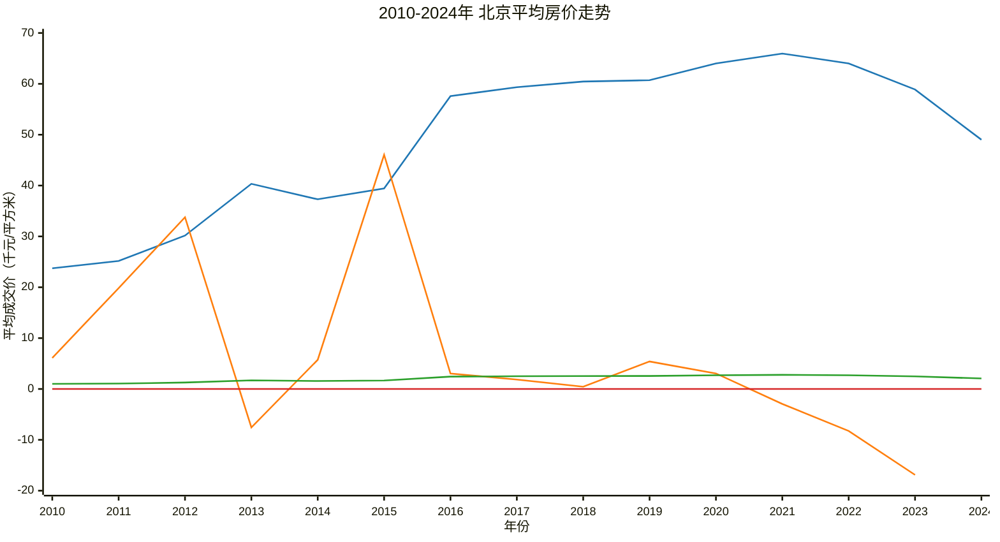

# 北京平均房价走势（2010-2024年）

| 年份 | 平均房价（千元/平方米） | 年增长率（%） | 比2010年增长倍数 |
|---|---|---|---|
| 2010 | 23.72 | - | 1 |
| 2011 | 25.17 | 8.64 | 1.06 |
| 2012 | 30.16 | 17.50 | 1.27 |
| 2013 | 40.34 | 33.77 | 1.70 |
| 2014 | 37.30 | -7.56 | 1.57 |
| 2015 | 39.44 | 5.74 | 1.66 |
| 2016 | 57.60 | 46.05 | 2.43 |
| 2017 | 59.34 | 3.03 | 2.50 |
| 2018 | 60.45 | 1.86 | 2.55 |
| 2019 | 60.72 | 0.45 | 2.56 |
| 2020 | 64.00 | 5.41 | 2.70 |
| 2021 | 65.96 | 3.05 | 2.78 |
| 2022 | 64.02 | -2.94 | 2.69 |
| 2023 | 58.88 | -8.25 | 2.48 |
| 2024 | 49.01 | -16.89 | 2.07 |

---
---

### 2010-2024年 北京平均房价走势

### 图例说明：
- **■** 平均成交价 (千元/平方米)
- **■** 年增长率（%）
- **■** 较2010年增长倍数
- **■** 0刻度线
### 图表说明：
- **图表标题：** 2010-2024年北京平均房价走势
- **x 轴：** 年份 (2010, 2011, ..., 2024)
- **y 轴：** 平均成交价 (千元/平方米) 、年增长率%和较2010年增长倍数(为了便于比较数字范围取 -20 --> 70)

### 数据说明：
本图表展示了2010年至2024年北京平均房价的变化趋势，为了便于显示，房价以千元为单位，增长率单位%。

### 注意事项：
- **y 轴范围：** -20 --> 70，确保清晰展示数据。
- **数据差异：** 请注意不同指标的单位一致性。
- **数据来源：** 官方公布数据。

☞版权所有©长征制图♛
