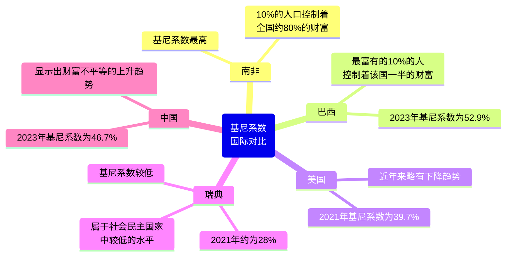

```mermaid
mindmap
  root(基尼系数<br>国际对比)
    南非
      基尼系数最高
      10%的人口控制着<br>全国约80%的财富
    巴西
      最富有的10%的人<br>控制着该国一半的财富
      2023年基尼系数为52.9%
    美国
      2021年基尼系数为39.7%
      近年来略有下降趋势
    瑞典
      基尼系数较低
      2021年约为28%
      属于社会民主国家<br>中较低的水平
    中国
      2023年基尼系数为46.7%
      显示出财富不平等的上升趋势
```