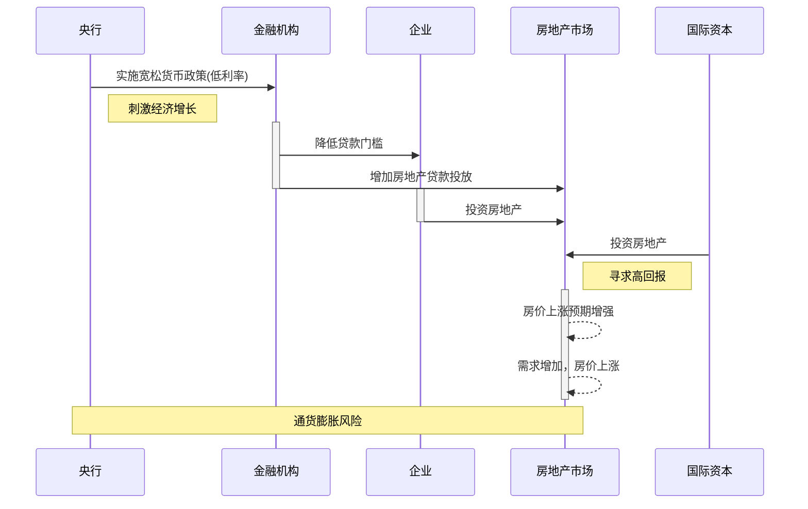
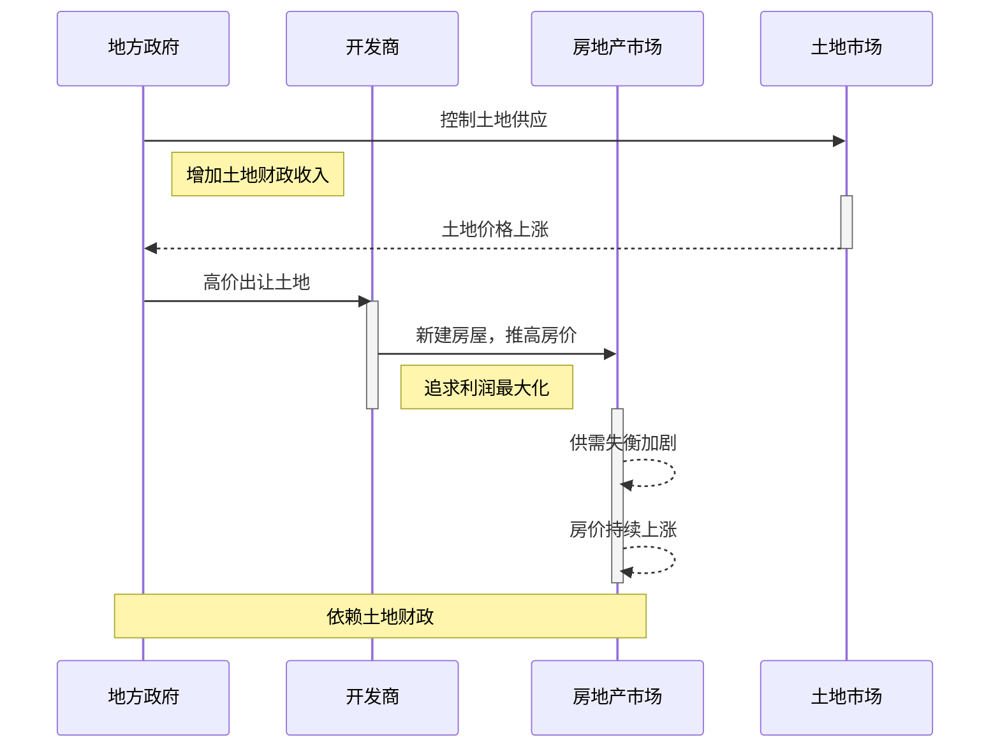
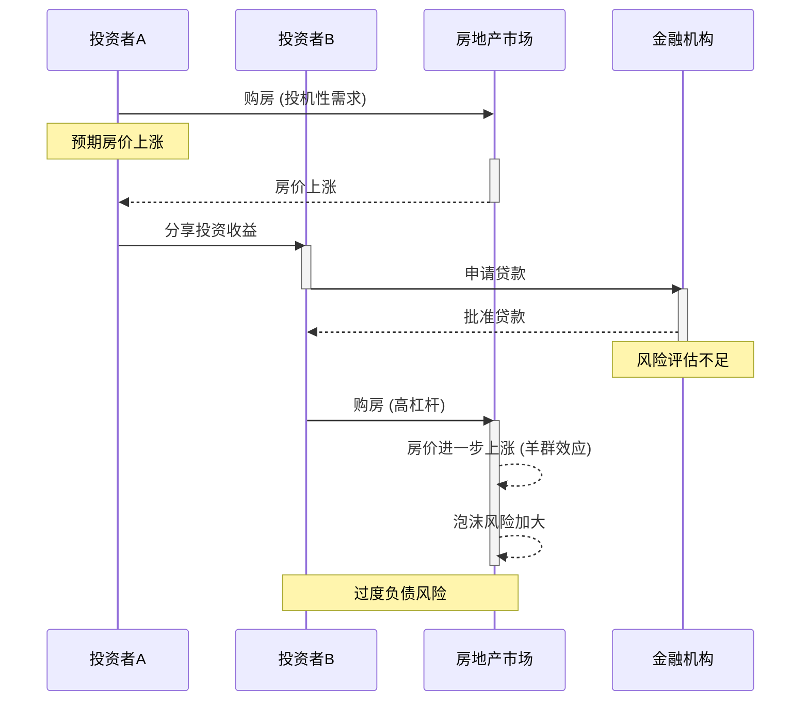

### 房地产泡沫的形成机制多维分析之一
---
**1. 宏观层面 :**

```mermaid
sequenceDiagram
    participant 央行
    participant 金融机构
    participant 企业
    participant 房地产市场
    participant 国际资本

    央行->>金融机构: 实施宽松货币政策(低利率)
    note right of 央行:  刺激经济增长
    activate 金融机构
    金融机构->>企业:  降低贷款门槛
    金融机构->>房地产市场: 增加房地产贷款投放
    deactivate 金融机构

    activate 企业
    企业->>房地产市场: 投资房地产
    deactivate 企业

    国际资本->>房地产市场: 投资房地产
    note left of 国际资本: 寻求高回报
    activate 房地产市场
    房地产市场-->>房地产市场: 房价上涨预期增强
    房地产市场-->>房地产市场: 需求增加，房价上涨
    deactivate 房地产市场
    note over 央行,房地产市场: 通货膨胀风险

```
---

**2. 中观层面 :**

```mermaid
sequenceDiagram
    participant 地方政府
    participant 开发商
    participant 房地产市场
    participant 土地市场

    地方政府->>土地市场:  控制土地供应
    note right of 地方政府:  增加土地财政收入
    activate 土地市场
    土地市场-->>地方政府: 土地价格上涨
    deactivate 土地市场

    地方政府->>开发商:  高价出让土地
    activate 开发商
    开发商->>房地产市场:  新建房屋，推高房价
    note right of 开发商:追求利润最大化
    deactivate 开发商

    activate 房地产市场
    房地产市场-->>房地产市场: 供需失衡加剧
    房地产市场-->>房地产市场: 房价持续上涨
    deactivate 房地产市场
    note over 地方政府,房地产市场:  依赖土地财政

```
---

**3. 微观层面 :**

```mermaid
sequenceDiagram
    participant 投资者A
    participant 投资者B
    participant 房地产市场
    participant 金融机构

    投资者A->>房地产市场: 购房 (投机性需求)
    note over 投资者A: 预期房价上涨
    activate 房地产市场
    房地产市场-->>投资者A: 房价上涨
    deactivate 房地产市场

    投资者A->>投资者B: 分享投资收益
    activate 投资者B
    投资者B->>金融机构: 申请贷款
    deactivate 投资者B
    activate 金融机构
    金融机构-->>投资者B:  批准贷款
    note over 金融机构: 风险评估不足
    deactivate 金融机构

    投资者B->>房地产市场:  购房 (高杠杆)
    activate 房地产市场
    房地产市场-->>房地产市场: 房价进一步上涨 (羊群效应)
    房地产市场-->>房地产市场: 泡沫风险加大
    deactivate 房地产市场
    note over 投资者B,房地产市场:  过度负债风险


```

---
☞版权所有©2024 长征♛