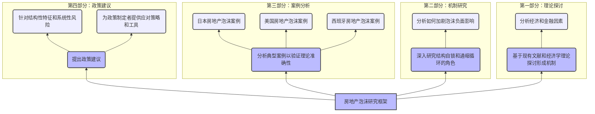

好的，为了更清晰地展示文章结构，并确保从上到下依次排列各个部分，我们将使用 `TD`（从上到下的方向）布局，并优化图表的层次和连接。以下是调整后的 `mermaid` 代码：

### 解释：
1. **布局**：
   - 使用 `TD`（从上到下的方向），使整个图表从上到下展开。
   - 每个部分都用 `subgraph` 包装，确保逻辑清晰。

2. **节点命名**：
   - 使用带编号的节点名称（如 `B1`, `D2` 等），以便于识别每个部分的内容。

3. **连接关系**：
   - 通过箭头连接各个节点，表示逻辑上的顺序和依赖关系。
   - 确保每个部分内部的逻辑关系清晰明确。

4. **子图**：
   - 使用 `subgraph` 将每个主要部分封装起来，保持结构的整洁和有序。
   - 子图按照从上到下的顺序排列，确保阅读顺序自然流畅。

5. **样式**：
   - 使用 `classDef` 定义不同类型的节点样式，使图表更美观易读。
   - `mainNode` 和 `subNode` 分别用于标识主要部分和次要部分。

这样，整个研究框架的逻辑关系一目了然，并且按照从上到下的顺序依次展示各个部分的内容。如果您有进一步的需求或需要调整，请随时告知。