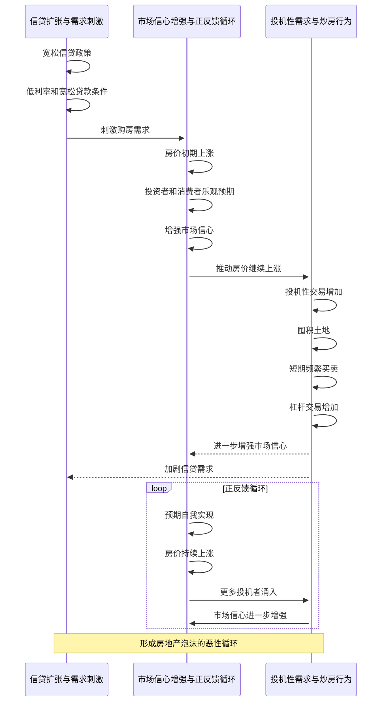

### 需求侧的自强化

---

**事件流程**：
   - **信贷扩张与需求刺激**：宽松信贷政策和低利率使得购房者更容易获得资金，从而刺激了购房需求。
   - **市场信心增强与正反馈循环**：房价初期上涨引发市场信心增强，形成正反馈循环，进一步推高房价。
   - **投机性需求与炒房行为**：投机者通过短期交易、囤积土地和杠杆交易加剧市场紧张，进一步推动房价上涨。

---
☞版权所有©2024 长征♛