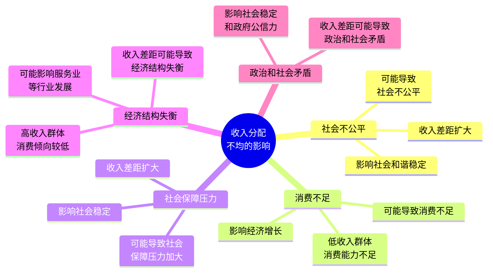

```mermaid
mindmap
  root((收入分配<br>不均的影响))
    社会不公平
      收入差距扩大
      可能导致<br>社会不公平
      影响社会和谐稳定
    消费不足
      低收入群体<br>消费能力不足
      可能导致消费不足
      影响经济增长
    社会保障压力
      收入差距扩大
      可能导致社会<br>保障压力加大
      影响社会稳定
    经济结构失衡
      收入差距可能导致<br>经济结构失衡
      高收入群体<br>消费倾向较低
      可能影响服务业<br>等行业发展
    政治和社会矛盾
      收入差距可能导致<br>政治和社会矛盾
      影响社会稳定<br>和政府公信力
```