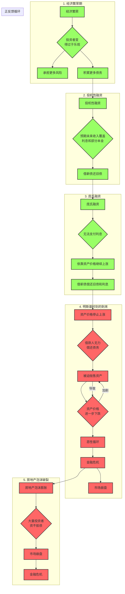

### 明斯基时刻

---
### 解释：
1. **分阶段展示**：每个主要阶段（经济繁荣期、投机性融资、庞氏融资、明斯基时刻的到来、房地产泡沫破裂）都用独立的子图表示，使逻辑更加清晰。
2. **正反馈循环**：明确标注了资产价格下跌和借款人行为之间的正反馈循环，以强调其重要性。
3. **连接各阶段**：通过箭头连接各个阶段，展示了从繁荣到危机的完整过程。
4. **颜色区分**：使用不同颜色区分正面和负面因素，使图表更易于理解：
   - **黄色**（`default`）：中性或过渡节点。
   - **绿色**（`positive`）：经济繁荣和早期融资阶段。
   - **红色**（`negative`）：危机爆发和市场崩盘阶段。
---
☞版权所有©2024 长征♛
