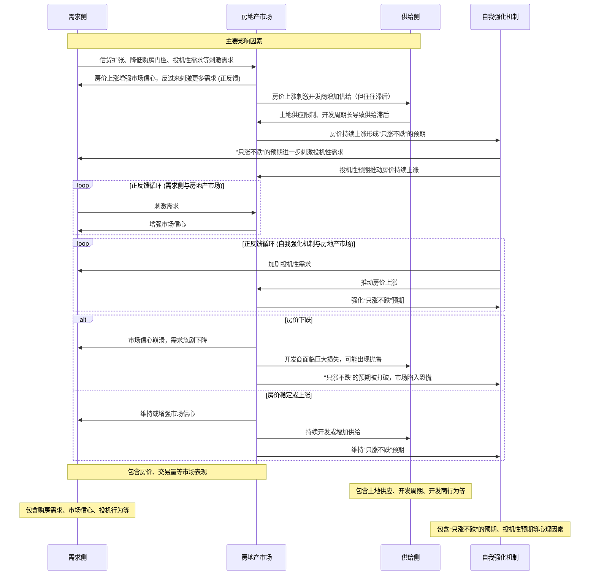

```mermaid
sequenceDiagram
    participant 需求侧
    participant 房地产市场
    participant 供给侧
    participant 自我强化机制

    note over 需求侧, 供给侧: 主要影响因素

    需求侧->>房地产市场: 信贷扩张、降低购房门槛、投机性需求等刺激需求
    房地产市场->>需求侧: 房价上涨增强市场信心，反过来刺激更多需求 (正反馈)
    房地产市场->>供给侧: 房价上涨刺激开发商增加供给（但往往滞后）
    供给侧->>房地产市场: 土地供应限制、开发周期长导致供给滞后
    房地产市场->>自我强化机制: 房价持续上涨形成“只涨不跌”的预期
    自我强化机制->>需求侧: “只涨不跌”的预期进一步刺激投机性需求
    自我强化机制->>房地产市场: 投机性预期推动房价持续上涨

    loop 正反馈循环 (需求侧与房地产市场)
        需求侧->>房地产市场: 刺激需求
        房地产市场->>需求侧: 增强市场信心
    end

    loop 正反馈循环 (自我强化机制与房地产市场)
        自我强化机制->>需求侧: 加剧投机性需求
        自我强化机制->>房地产市场: 推动房价上涨
        房地产市场->>自我强化机制: 强化“只涨不跌”预期
    end

    alt 房价下跌
        房地产市场->>需求侧: 市场信心崩溃，需求急剧下降
        房地产市场->>供给侧: 开发商面临巨大损失，可能出现抛售
        房地产市场->>自我强化机制: “只涨不跌”的预期被打破，市场陷入恐慌
    else 房价稳定或上涨
        房地产市场->>需求侧: 维持或增强市场信心
        房地产市场->>供给侧: 持续开发或增加供给
        房地产市场->>自我强化机制: 维持“只涨不跌”预期
    end

    note over 房地产市场,需求侧: 包含房价、交易量等市场表现
    note over 供给侧: 包含土地供应、开发周期、开发商行为等
    note over 需求侧: 包含购房需求、市场信心、投机行为等
    note over 自我强化机制: 包含“只涨不跌”的预期、投机性预期等心理因素
```
---
☞版权所有©2024 长征♛