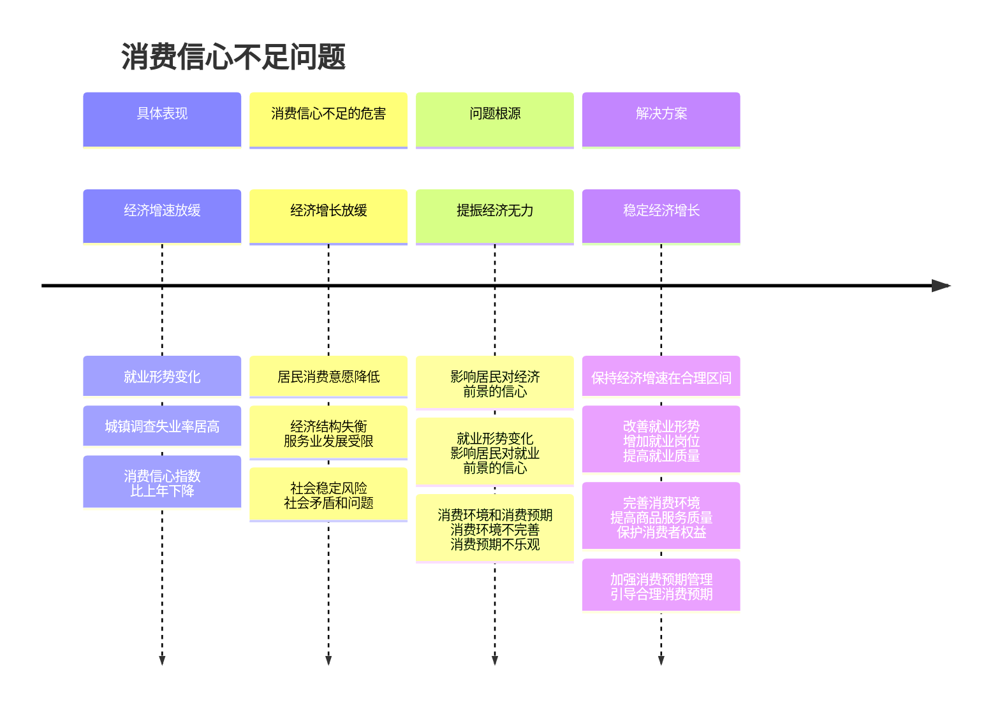

```mermaid
timeline
    title 消费信心不足问题
    section 具体表现
        经济增速放缓: 就业形势变化
        :  城镇调查失业率居高 
        : 消费信心指数 比上年下降
    section 消费信心不足的危害
        经济增长放缓: 居民消费意愿降低
       : 经济结构失衡 服务业发展受限
       : 社会稳定风险 社会矛盾和问题
    section 问题根源
        提振经济无力: 影响居民对经济 前景的信心
        : 就业形势变化 影响居民对就业 前景的信心
        : 消费环境和消费预期 消费环境不完善 消费预期不乐观
    section 解决方案
        稳定经济增长: 保持经济增速在合理区间
       : 改善就业形势 增加就业岗位 提高就业质量
        : 完善消费环境 提高商品服务质量 保护消费者权益
        : 加强消费预期管理 引导合理消费预期
```