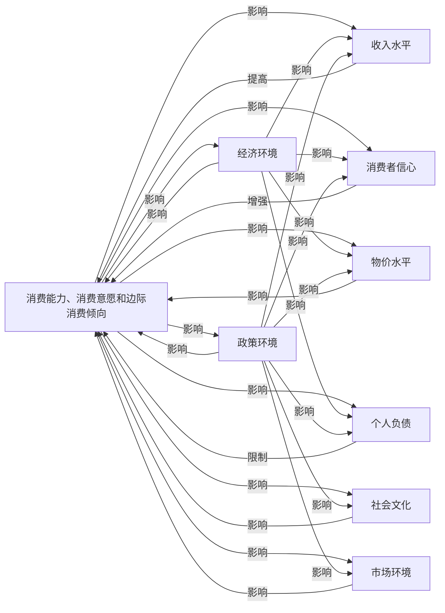

### 解释
1. **中心节点**：`A` 表示“消费能力、消费意愿和边际消费倾向”。
2. **主要因素**：`B` 到 `I` 分别表示收入水平、消费者信心、经济环境、物价水平、个人负债、社会文化、政策环境和市场环境。
3. **影响关系**：箭头表示各个因素对消费能力、消费意愿和边际消费倾向的影响。
4. **双向影响**：部分因素之间也存在相互影响，例如经济环境对收入水平、消费者信心、物价水平和个人负债都有影响，政策环境对多个因素也有影响。

  
 