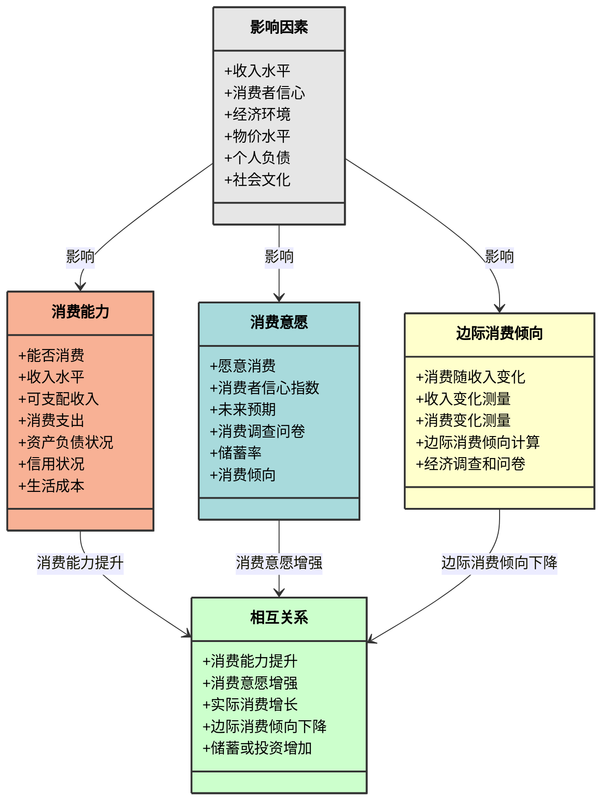

### 代码说明：
1. **类定义**：
   - `消费能力` 类包含属性：能否消费、收入水平、可支配收入、消费支出、资产负债状况、信用状况、生活成本。
   - `消费意愿` 类包含属性：愿意消费、消费者信心指数、未来预期、消费调查问卷、储蓄率、消费倾向。
   - `边际消费倾向` 类包含属性：消费随收入变化、收入变化测量、消费变化测量、边际消费倾向计算、经济调查和问卷。
   - `影响因素` 类包含属性：收入水平、消费者信心、经济环境、物价水平、个人负债、社会文化。
   - `相互关系` 类包含属性：消费能力提升、消费意愿增强、实际消费增长、边际消费倾向下降、储蓄或投资增加。

2. **样式定义**：
   - `consumerAbility` 样式：
     - 填充颜色：浅橙色（`#f8b195`）。
     - 文字颜色：黑色（`color:#000`）。
     - 边框颜色：深灰色（`#333`）。
     - 边框宽度：`2px`。
   - `consumerWillingness` 样式：
     - 填充颜色：浅蓝色（`#a8dadc`）。
     - 文字颜色：黑色（`color:#000`）。
     - 边框颜色：深灰色（`#333`）。
     - 边框宽度：`2px`。
   - `marginalPropensity` 样式：
     - 填充颜色：浅黄色（`#ffc`）。
     - 文字颜色：黑色（`color:#000`）。
     - 边框颜色：深灰色（`#333`）。
     - 边框宽度：`2px`。
   - `influencingFactors` 样式：
     - 填充颜色：浅灰色（`#e6e6e6`）。
     - 文字颜色：黑色（`color:#000`）。
     - 边框颜色：深灰色（`#333`）。
     - 边框宽度：`2px`。
   - `interaction` 样式：
     - 填充颜色：浅绿色（`#cfc`）。
     - 文字颜色：黑色（`color:#000`）。
     - 边框颜色：深灰色（`#333`）。
     - 边框宽度：`2px`。

3. **关系定义**：
   - `消费能力`、`消费意愿` 和 `边际消费倾向` 通过 `相互关系` 类相互影响。
   - `影响因素` 类对 `消费能力`、`消费意愿` 和 `边际消费倾向` 产生影响。

