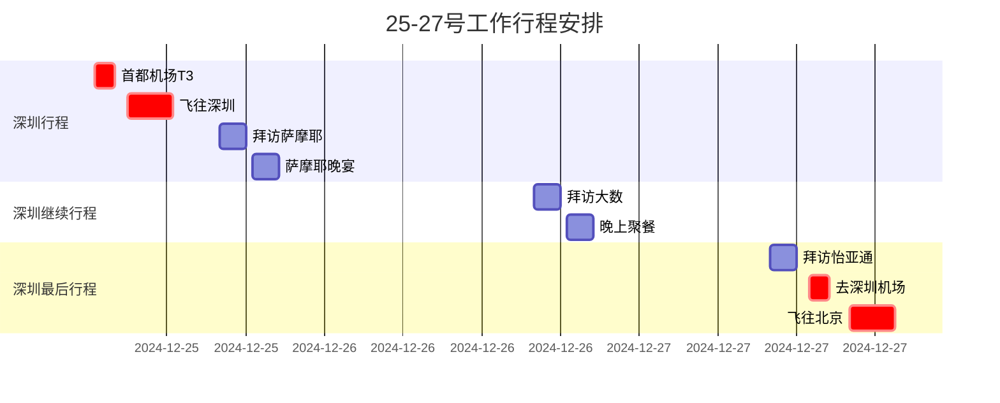

### 25-27深圳出差日程表
---

---
### 图例说明：
* **出发**：25号上午6点半出发去首都机场， 09:00 - 12:30飞深圳（待完成）
* **拜访萨摩耶**：25号下午 16:00 - 18:00
* **萨摩耶晚餐**：25号下午 18:30 - 20:30
* **拜访大数**：26号下午 16:00 - 18:00
* **晚上聚餐**：26号晚上 18:30 - 20:30
* **拜访怡亚通**：27号上午 10:00 - 12:00
* **飞往北京**：27号下午13点赶往深圳机场， 16:00 - 19:30飞北京（关键路径）

### 关键点提示：
- **关键路径**：标记为 `crit` 的任务是重要的转接节点，确保按时完成以不影响后续行程。

☞版权所有©2024 长征♛😊