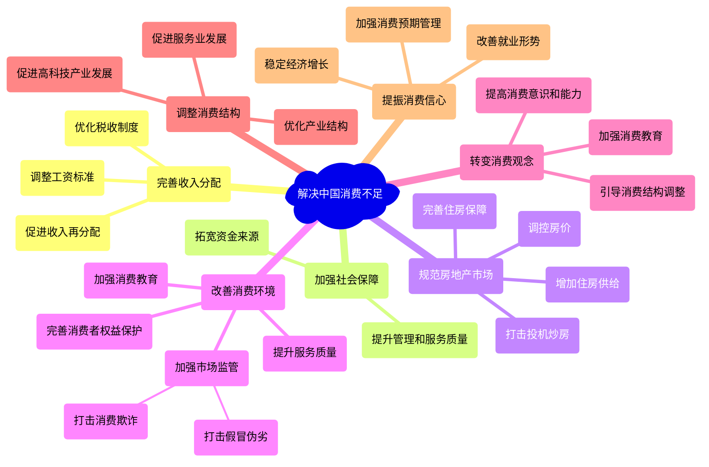

```mermaid
mindmap
  root(解决中国消费不足))
    sub("完善收入分配")
      a1(调整工资标准)
      a2(优化税收制度)
      a3(促进收入再分配)
    sub("加强社会保障")
      b1(拓宽资金来源)
      b2(提升管理和服务质量)
    sub("规范房地产市场")
      c1(调控房价)
      c2(增加住房供给)
      c3(打击投机炒房)
      c4(完善住房保障)
    sub("改善消费环境")
      d1(加强市场监管)
        d1a(打击假冒伪劣)
        d1b(打击消费欺诈)
      d2(完善消费者权益保护)
      d3(提升服务质量)
      d4(加强消费教育)
    sub("转变消费观念")
      e1(加强消费教育)
      e2(提高消费意识和能力)
      e3(引导消费结构调整)
    sub("调整消费结构")
      f1(促进服务业发展)
      f2(促进高科技产业发展)
      f3(优化产业结构)
    sub("提振消费信心")
      g1(稳定经济增长)
      g2(改善就业形势)
      g3(加强消费预期管理)
```      
  **备注:**
促进消费增长拉动经济增长 满足人民美好生活需要 推动经济和社会的可持续发展