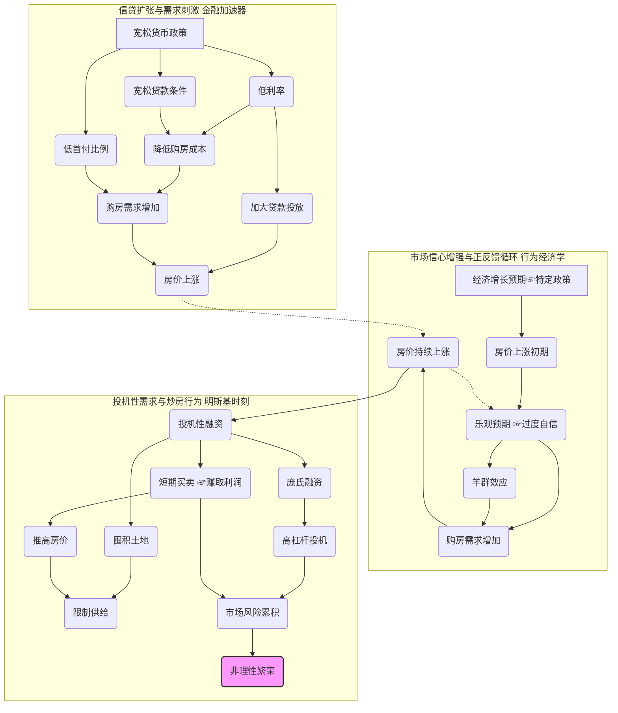

### 需求侧推动泡沫

###  图表逻辑解释

1. **信贷扩张与需求刺激**: 宽松的货币政策和信贷政策导致低利率、宽松贷款条件和低首付比例，刺激购房需求，最终推高房价。
2. **市场信心增强与正反馈循环**:  房价上涨初期受到经济增长预期或特定政策的影响，进而引发乐观预期和羊群效应，形成正反馈循环，进一步推高房价。
3. **投机性需求与炒房行为**:  随着房价持续上涨，市场进入投机性融资阶段，短期买卖、囤积土地、庞氏融资等行为加剧，最终导致市场风险累积和非理性繁荣。

---
☞版权所有©2024 长征♛

