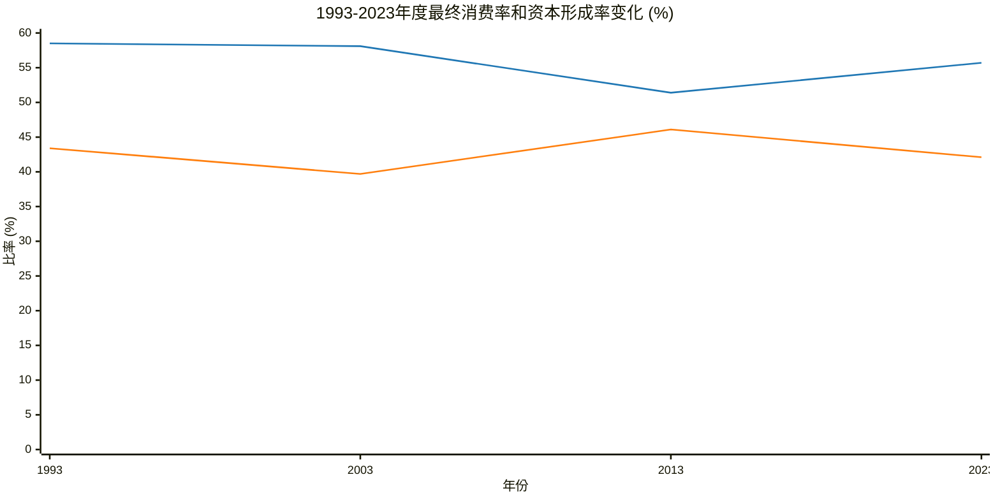

## 1993-2023年度支出法生产总值
| 时间 | 2023年(万亿元) | 2013年(万亿元) | 2003年(万亿元) | 1993年(万亿元) |
|---|---|---|---|---|
| 支出法生产总值 | 125.9 | 59.6 | 13.7 | 3.6 |
| 最终消费 | 70.1 | 30.7 | 7.9 | 2.1 |
| 居民消费 | 49.3 | 21.2 | 5.9 | 1.6 |
| 农村居民消费 | 10.4 | 4.7 | 1.8 | 0.7 |
| 城镇居民消费 | 39.0 | 16.6 | 4.1 | 0.9 |
| 政府消费 | 20.8 | 9.4 | 2.1 | 0.5 |
| 资本形成总额 | 53.0 | 27.5 | 5.4 | 1.5 |
| 固定资本形成总额 | 52.1 | 26.4 | 5.3 | 1.3 |
| 存货变动 | 0.9 | 1.1 | 0.2 | 0.2 |
| 货物和服务净出口 | 2.7 | 1.5 | 0.3 | -0.1 |
| 最终消费率(%) | 55.7 | 51.4 | 58.1 | 58.5 |
| 资本形成率(%) | 42.1 | 46.1 | 39.7 | 43.4 |

### 图表和解读

```mermaid
---
config:
    xyChart:
        width: 1200
        height: 600
    themeVariables:
        xyChart:
            plotColorPalette: "#1f77b4, #ff7f0e, #2ca02c, #d62728, #9467bd, #8c564b"
---

xychart-beta
    title "1993-2023年度支出法生产总值及其构成变化 (万亿元)"
    x-axis "年份" [1993, 2003, 2013, 2023]
    y-axis "金额 (万亿元)" 0 --> 140
    
    %% 支出法生产总值
    line "支出法生产总值 (万亿元)" [3.6, 13.7, 59.6, 125.9]
    
    %% 最终消费
    bar "最终消费 (万亿元)" [2.1, 7.9, 30.7, 70.1]
    
    %% 资本形成总额
    bar "资本形成总额 (万亿元)" [1.5, 5.4, 27.5, 53.0]
    
    %% 货物和服务净出口
    line "货物和服务净出口 (万亿元)" [-0.1, 0.3, 1.5, 2.7]
```

### 图例说明
*   — 支出法生产总值 (万亿元)
*   ■ 最终消费 (万亿元)
*   ■ 资本形成总额 (万亿元)
*   — 货物和服务净出口 (万亿元)

### 图表说明
*   **图表标题：** 1993-2023年度支出法生产总值及其构成变化 (万亿元)
*   **x 轴：** 年份，包括 1993、2003、2013 和 2023 年。
*   **y 轴：** 金额 (万亿元)，范围设置为 `0 --> 140`，以确保所有数据点都能完整显示。
*   **注释：**
    * 支出法生产总值涵盖了最终消费、资本形成总额和货物及服务净出口。
    * 数据来源为官方统计数据。

### 按最终消费细分类别

```mermaid
---
config:
    xyChart:
        width: 1200
        height: 600
    themeVariables:
        xyChart:
            plotColorPalette: "#1f77b4, #ff7f0e, #2ca02c, #d62728, #9467bd, #8c564b"
---

xychart-beta
    title "1993-2023年度最终消费细分类别变化 (万亿元)"
    x-axis "年份" [1993, 2003, 2013, 2023]
    y-axis "金额 (万亿元)" 0 --> 80
    
    %% 居民消费
    bar "居民消费 (万亿元)" [1.6, 5.9, 21.2, 49.3]
    
    %% 农村居民消费
    bar "农村居民消费 (万亿元)" [0.7, 1.8, 4.7, 10.4]
    
    %% 城镇居民消费
    bar "城镇居民消费 (万亿元)" [0.9, 4.1, 16.6, 39.0]
    
    %% 政府消费
    line "政府消费 (万亿元)" [0.5, 2.1, 9.4, 20.8]
```

### 图例说明
*   ■ 居民消费 (万亿元)
*   ■ 农村居民消费 (万亿元)
*   ■ 城镇居民消费 (万亿元)
*   — 政府消费 (万亿元)

### 图表说明
*   **图表标题：** 1993-2023年度最终消费细分类别变化 (万亿元)
*   **x 轴：** 年份，包括 1993、2003、2013 和 2023 年。
*   **y 轴：** 金额 (万亿元)，范围设置为 `0 --> 80`，以确保所有数据点都能完整显示。
*   **注释：**
    * 本部分展示最终消费中的居民消费和政府消费的细分情。
    * 最终消费分为居民消费和政府消费。
    * 居民消费又细分为农村居民消费和城镇居民消费。
    * 数据来源为官方统计数据。

### 最终消费率和资本形成率的变化

### 图例说明
*   — 最终消费率 (%)
*   — 资本形成率 (%)

### 图表说明
*   **图表标题：** 1993-2023年度最终消费率和资本形成率变化 (%)
*   **x 轴：** 年份，包括 1993、2003、2013 和 2023 年。
*   **y 轴：** 比率 (%)，范围设置为 `0 --> 60`，以确保所有数据点都能完整显示。
*   **注释：**
    * 数据来源为官方统计数据。
