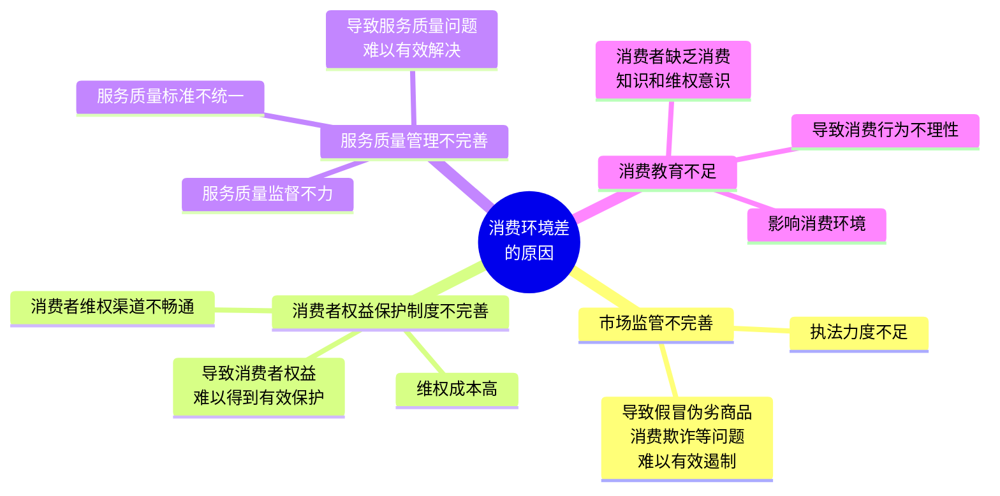

```mermaid
mindmap
  root((消费环境差<br>的原因))
    市场监管不完善
      执法力度不足
      导致假冒伪劣商品<br>消费欺诈等问题<br>难以有效遏制
    消费者权益保护制度不完善
      消费者维权渠道不畅通
      维权成本高
      导致消费者权益<br>难以得到有效保护
    服务质量管理不完善
      服务质量标准不统一
      服务质量监督不力
      导致服务质量问题<br>难以有效解决
    消费教育不足
      消费者缺乏消费<br>知识和维权意识
      导致消费行为不理性
      影响消费环境
```