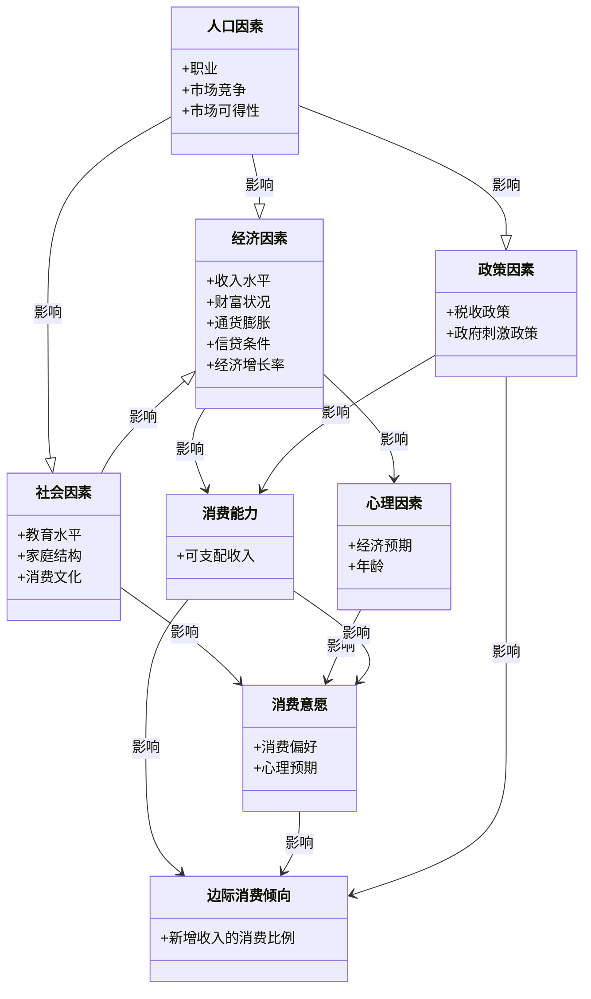

### 各类因素对消费影响关系图

### 关系解释

1. **人口因素**：
   - 通过职业、市场竞争和市场可得性影响经济、政策和社会因素。
2. **经济因素**：
   - 影响消费能力（如收入水平）和心理因素（如经济预期），同时与社会因素相互作用。
3. **政策因素**：
   - 通过税收和政府刺激政策影响消费能力和边际消费倾向。

4. **社会因素**：
   - 教育水平、家庭结构和消费文化影响消费意愿。

5. **心理因素**：
   - 经济预期和年龄影响消费意愿。

6. **消费能力与消费意愿**：
   - 更强的消费能力会提升消费者的消费意愿。

7. **边际消费倾向**：
   - 消费能力、消费意愿和政策因素共同影响消费者对新增收入的消费比例。
