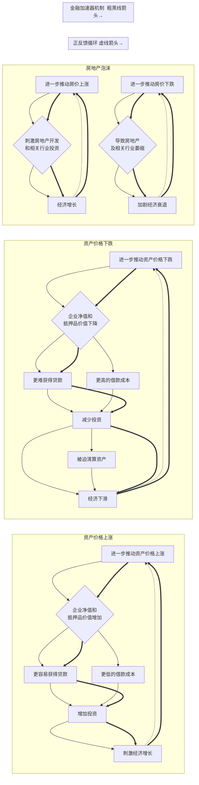

### 金融加速器理论

---
### 解释：
1. **资产价格上涨**：当资产价格上涨时，企业的净值和抵押品价值增加，这使得它们更容易获得贷款，并且可以以更低的利率借款，从而鼓励企业增加投资，刺激经济增长。
2. **资产价格下跌**：相反，当资产价格下跌时，企业的净值和抵押品价值下降，这使得它们更难获得贷款，并且面临更高的借款成本，导致企业减少投资，甚至可能被迫清算资产以偿还债务，从而加剧经济下滑。
3. **房地产泡沫**：房价上涨会刺激房地产开发和相关行业的投资，而房价下跌则会迅速导致这些行业的萎缩，并可能引发更广泛的经济衰退。
4. **正反馈循环**：展示了资产价格波动如何通过金融加速器机制形成正反馈循环，进一步放大其影响。
5. **金融加速器机制**：用箭头表示了各个因素之间的因果关系，突显了金融加速器的核心机制。
---
☞版权所有©2024 长征♛
